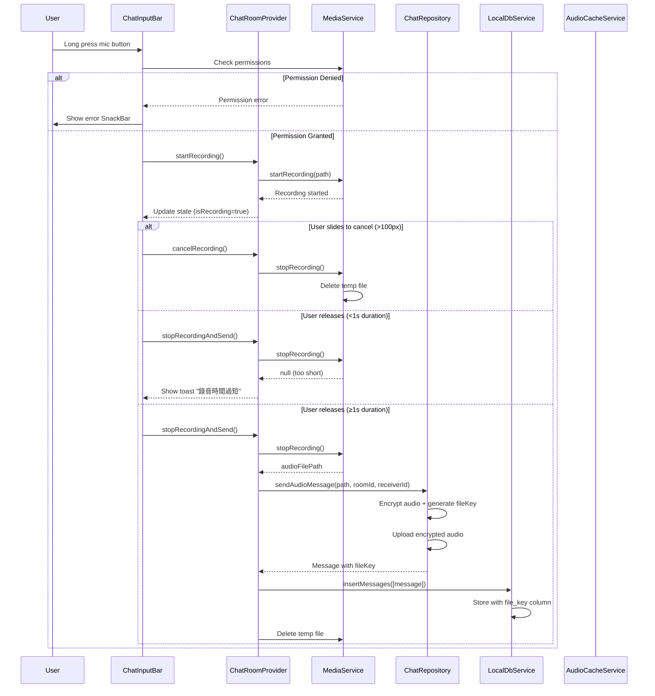
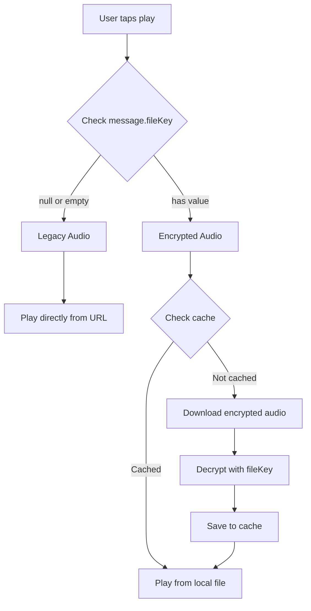

# Design Document: Encrypted Audio Messaging UI Completion

## Overview

This design completes the encrypted audio messaging feature by enhancing the recording user experience, ensuring database schema compatibility, integrating state management layers, and adding support for legacy unencrypted audio caching. The core encryption/decryption infrastructure already exists in `ChatRepository` and `AudioCacheService`.

The implementation focuses on five key areas:

1. **Enhanced Recording UI**: Slide-to-cancel gesture, accidental touch protection, and permission error handling in `chat_input_bar.dart`
2. **Database Schema**: Verification and migration logic for the `file_key` column in `local_db_service.dart`
3. **State Management Integration**: Connecting `stopRecordingAndSend` to `chatRepository.sendAudioMessage` in `chat_room_provider.dart`
4. **Legacy Audio Caching**: Local caching for unencrypted audio messages in `audio_message_bubble.dart`
5. **Test Coverage**: Widget tests for UI interactions and unit tests for state management

## Architecture

### Component Interaction Flow



### Playback Flow (Legacy vs Encrypted)



## Components and Interfaces

### 1. ChatInputBar (chat_input_bar.dart)

#### New State Variables

```dart
class _ChatInputBarState extends ConsumerState<ChatInputBar> {
  // Existing state...
  
  // New gesture tracking state
  Offset? _recordingStartPosition;
  Offset? _currentDragPosition;
  bool _isCancelThresholdReached = false;
  
  // Constants
  static const double _cancelThreshold = 100.0; // pixels
  static const Duration _minRecordingDuration = Duration(seconds: 1);
}
```

#### Gesture Detection Implementation

Replace the existing `GestureDetector` for the microphone button with:

```dart
GestureDetector(
  onLongPressStart: (details) async {
    // Check permissions first
    final mediaService = ref.read(mediaServiceProvider);
    final hasPermission = await mediaService.checkMicrophonePermission();
    
    if (!hasPermission) {
      HapticFeedback.heavyImpact();
      if (!mounted) return;
      ScaffoldMessenger.of(context).showSnackBar(
        SnackBar(
          content: const Text('需要麥克風權限才能錄音'),
          action: SnackBarAction(
            label: '設定',
            onPressed: () => mediaService.openAppSettings(),
          ),
        ),
      );
      return;
    }
    
    // Start recording
    HapticFeedback.mediumImpact();
    setState(() {
      _recordingStartPosition = details.globalPosition;
      _currentDragPosition = details.globalPosition;
      _isCancelThresholdReached = false;
      _recordingSeconds = 0;
    });
    
    _recordingTimer?.cancel();
    _recordingTimer = Timer.periodic(
      const Duration(seconds: 1),
      (_) {
        if (!mounted) return;
        setState(() => _recordingSeconds += 1);
      },
    );
    
    ref.read(chatRoomProvider(widget.params).notifier).startRecording();
  },
  
  onLongPressMoveUpdate: (details) {
    if (_recordingStartPosition == null) return;
    
    setState(() {
      _currentDragPosition = details.globalPosition;
    });
    
    final dragDistance = (_recordingStartPosition!.dx - details.globalPosition.dx).abs();
    final wasThresholdReached = _isCancelThresholdReached;
    _isCancelThresholdReached = dragDistance > _cancelThreshold;
    
    // Provide haptic feedback when threshold is reached
    if (_isCancelThresholdReached && !wasThresholdReached) {
      HapticFeedback.mediumImpact();
    }
  },
  
  onLongPressEnd: (details) async {
    final recordingDuration = Duration(seconds: _recordingSeconds);
    
    _recordingTimer?.cancel();
    
    // Check if cancelled by slide gesture
    if (_isCancelThresholdReached) {
      HapticFeedback.lightImpact();
      await ref.read(chatRoomProvider(widget.params).notifier).cancelRecording();
      setState(() {
        _recordingStartPosition = null;
        _currentDragPosition = null;
        _isCancelThresholdReached = false;
        _recordingSeconds = 0;
      });
      return;
    }
    
    // Check if recording is too short
    if (recordingDuration < _minRecordingDuration) {
      HapticFeedback.lightImpact();
      await ref.read(chatRoomProvider(widget.params).notifier).cancelRecording();
      if (!mounted) return;
      ScaffoldMessenger.of(context).showSnackBar(
        const SnackBar(
          content: Text('錄音時間過短'),
          duration: Duration(seconds: 2),
        ),
      );
      setState(() {
        _recordingStartPosition = null;
        _currentDragPosition = null;
        _recordingSeconds = 0;
      });
      return;
    }
    
    // Send the recording
    HapticFeedback.lightImpact();
    await ref.read(chatRoomProvider(widget.params).notifier).stopRecordingAndSend();
    
    setState(() {
      _recordingStartPosition = null;
      _currentDragPosition = null;
      _isCancelThresholdReached = false;
      _recordingSeconds = 0;
    });
  },
  
  child: Container(
    // Existing mic button UI...
  ),
)
```

#### Visual Feedback During Recording

Update the recording UI to show slide-to-cancel feedback:

```dart
child: state.isRecording
    ? Row(
        children: [
          if (_isCancelThresholdReached)
            Text(
              '🚫 鬆開取消',
              style: TextStyle(
                color: Colors.red,
                fontWeight: FontWeight.bold,
              ),
            )
          else
            FadeTransition(
              opacity: _recordingOpacity,
              child: Text(
                '🔴 正在錄音... ← 滑動取消',
                style: TextStyle(
                  color: tokens.bubbleText,
                  fontStyle: FontStyle.italic,
                ),
              ),
            ),
          const SizedBox(width: 8),
          Text(
            _formatRecordingTime(_recordingSeconds),
            style: TextStyle(
              color: tokens.subtleText,
              fontSize: 12,
            ),
          ),
        ],
      )
    : // Existing text input UI...
```

### 2. ChatRoomProvider (chat_room_provider.dart)

#### New Methods

```dart
/// Cancels the current recording and deletes the temporary file
Future<void> cancelRecording() async {
  final mediaService = ref.read(mediaServiceProvider);
  state = state.copyWith(isRecording: false);
  
  final path = await mediaService.stopRecording();
  if (path != null && path.isNotEmpty) {
    try {
      await File(path).delete();
      debugPrint('✅ Deleted cancelled recording: $path');
    } catch (e) {
      debugPrint('⚠️ Failed to delete cancelled recording: $e');
    }
  }
}
```

#### Updated stopRecordingAndSend Method

The existing implementation already calls `chatRepository.sendAudioMessage`, but we need to ensure proper error handling and cleanup:

```dart
Future<void> stopRecordingAndSend() async {
  final mediaService = ref.read(mediaServiceProvider);
  state = state.copyWith(isRecording: false);
  final path = await mediaService.stopRecording();
  
  // Check if recording is valid
  if (path == null || path.isEmpty) {
    debugPrint('⚠️ Recording path is null or empty');
    return;
  }

  final replyToId = state.replyingToMessage?.id;
  state = state.copyWith(isSending: true);
  
  try {
    // Use the encrypted audio sending method
    final message = await _chatRepository.sendAudioMessage(
      audioFilePath: path,
      roomId: arg.isRoom ? arg.roomId : '',
      receiverId: arg.isRoom ? null : arg.roomId,
    );

    // Update message with reply info if needed
    if (replyToId != null) {
      final updatedMessage = message.copyWith(
        replyToMessageId: replyToId,
        replyToMessage: state.replyingToMessage,
      );
      _addMessage(updatedMessage);
      state = state.copyWith(replyingToMessage: null);
    } else {
      _addMessage(message);
    }

    state = state.copyWith(isSending: false);
    
    // Clean up temporary audio file
    try {
      await File(path).delete();
      debugPrint('✅ Deleted temp audio file: $path');
    } catch (e) {
      debugPrint('⚠️ Failed to delete temp audio file: $e');
    }
  } catch (e) {
    state = state.copyWith(isSending: false, error: e.toString());
    debugPrint('❌ Failed to send audio message: $e');
    
    // Still try to clean up temp file on error
    try {
      await File(path).delete();
    } catch (cleanupError) {
      debugPrint('⚠️ Failed to delete temp file after error: $cleanupError');
    }
  }
}
```

### 3. LocalDbService (local_db_service.dart)

#### Database Version Update

The database is currently at version 5, and the `file_key` column already exists in the schema. The `_ensureMessagesColumns` method already includes migration logic for the `file_key` column, so no changes are needed.

#### Verification

The existing implementation already:
- Creates the `file_key TEXT` column in `_createMessagesTable`
- Adds the column via `ALTER TABLE` in `_ensureMessagesColumns` if missing
- Maps the column correctly in `Message.fromMap` and `Message.toMap`

### 4. AudioMessageBubble (audio_message_bubble.dart)

#### Legacy Audio Caching Implementation

Update the `_loadAndPlay` method to cache legacy audio:

```dart
Future<void> _loadAndPlay() async {
  setState(() {
    _playbackState = AudioPlaybackState.loading;
    _error = null;
  });

  try {
    final audioCacheService = ref.read(audioCacheServiceProvider);
    final fileKey = widget.message.fileKey;
    final audioUrl = widget.message.content;
    
    if (fileKey == null || fileKey.isEmpty) {
      // Legacy unencrypted audio - download and cache
      final localPath = await _downloadAndCacheLegacyAudio(
        audioCacheService,
        audioUrl,
      );
      
      _cachedFilePath = localPath;
      await _player.play(DeviceFileSource(localPath));
      
      if (!mounted) return;
      setState(() => _playbackState = AudioPlaybackState.playing);
      return;
    }

    // Encrypted audio - use existing flow
    final localPath = await audioCacheService.getOrDownloadAudio(
      messageId: widget.message.id,
      audioUrl: audioUrl,
      fileKey: fileKey,
    );

    _cachedFilePath = localPath;
    await _player.play(DeviceFileSource(localPath));
    
    if (!mounted) return;
    setState(() => _playbackState = AudioPlaybackState.playing);
  } on AudioCacheException catch (e) {
    if (!mounted) return;
    setState(() {
      _playbackState = AudioPlaybackState.error;
      _error = _getErrorMessage(e);
    });
  } catch (e) {
    if (!mounted) return;
    setState(() {
      _playbackState = AudioPlaybackState.error;
      _error = 'Failed to play audio: ${e.toString()}';
    });
  }
}

/// Downloads and caches legacy unencrypted audio
Future<String> _downloadAndCacheLegacyAudio(
  AudioCacheService cacheService,
  String audioUrl,
) async {
  // Use message ID as cache key for legacy audio
  final cacheKey = 'legacy_${widget.message.id}';
  
  // Check if already cached
  if (await cacheService.isCached(cacheKey)) {
    final cachedPath = await cacheService._getCacheFilePath(cacheKey);
    final file = File(cachedPath);
    if (await file.exists()) {
      debugPrint('✅ Legacy audio cache hit for message: ${widget.message.id}');
      return cachedPath;
    }
  }
  
  debugPrint('⬇️ Downloading legacy audio for message: ${widget.message.id}');
  
  // Download audio directly (no decryption needed)
  final dio = Dio();
  final response = await dio.get<List<int>>(
    audioUrl,
    options: Options(
      responseType: ResponseType.bytes,
      receiveTimeout: const Duration(seconds: 30),
    ),
  );
  
  if (response.data == null) {
    throw AudioCacheException(
      type: AudioCacheErrorType.networkError,
      message: 'Download failed: empty response',
    );
  }
  
  // Save to cache
  final cacheDir = await getTemporaryDirectory();
  final filePath = p.join(cacheDir.path, 'audio_$cacheKey.m4a');
  final file = File(filePath);
  await file.parent.create(recursive: true);
  await file.writeAsBytes(response.data!);
  
  debugPrint('✅ Legacy audio cached successfully: $filePath');
  return filePath;
}
```

### 5. AudioCacheService (audio_cache_service.dart)

#### Expose Cache Path Method

Make `_getCacheFilePath` public or add a helper method for legacy audio caching:

```dart
/// Gets the cache file path for a message ID (public for legacy audio)
Future<String> getCacheFilePath(String messageId) async {
  final cacheDir = await getTemporaryDirectory();
  return p.join(cacheDir.path, 'audio_$messageId.m4a');
}
```

## Data Models

### Message Model

The `Message` model already includes the `fileKey` field:

```dart
class Message {
  final String id;
  final String? clientMsgId;
  final String content;
  final String senderId;
  final String? receiverId;
  final String? roomId;
  final String? replyToMessageId;
  final Message? replyToMessage;
  final Map<String, List<String>>? reactions;
  final bool isUnsent;
  final MessageType type;
  final DateTime createdAt;
  final bool isRead;
  final MessageStatus status;
  final DateTime? readAt;
  final List<String> readBy;
  final LinkPreview? linkPreview;
  final String? fileKey; // ✅ Already exists
  
  // ... constructor and methods
}
```

### Database Schema

The `messages` table already includes the `file_key` column:

```sql
CREATE TABLE messages(
  id TEXT PRIMARY KEY,
  client_msg_id TEXT,
  room_id TEXT,
  sender_id TEXT,
  receiver_id TEXT,
  reply_to_message_id TEXT,
  reactions TEXT,
  is_unsent INTEGER DEFAULT 0,
  content TEXT,
  type TEXT,
  created_at INTEGER,
  is_read INTEGER,
  read_at INTEGER,
  read_by TEXT,
  status TEXT DEFAULT "sent",
  link_preview TEXT,
  file_key TEXT  -- ✅ Already exists
)
```


## Correctness Properties

A property is a characteristic or behavior that should hold true across all valid executions of a system—essentially, a formal statement about what the system should do. Properties serve as the bridge between human-readable specifications and machine-verifiable correctness guarantees.

### Property Reflection

After analyzing all acceptance criteria, I identified the following redundancies:

- Properties 1.4, 2.2, and 6.5 all test temporary file deletion - these can be combined into one comprehensive cleanup property
- Properties 1.2, 8.1, and 8.2 all test visual feedback during drag - these can be combined
- Properties 1.5, 9.3, and 9.5 all test state reset - these can be combined
- Properties 4.3 and 4.4 both test database round-trip - 4.4 is redundant
- Properties 5.3 and 5.5 both test data preservation during migration - 5.5 is redundant
- Properties 7.4 and 12.1 both test cache filename format - 12.1 is redundant
- Properties 7.5 and 12.5 both test cache directory - 12.5 is redundant

The following properties provide unique validation value and will be included:

### Property 1: Slide-to-cancel gesture detection

*For any* recording session, when the user drags their finger more than 100 pixels horizontally from the initial touch point, the recording SHALL be cancelled without sending a message.

**Validates: Requirements 1.1**

### Property 2: Visual feedback during slide gesture

*For any* recording session with active dragging, when the drag distance exceeds the cancellation threshold (100px), the UI SHALL display "🚫 鬆開取消" in red color; otherwise it SHALL display "← 滑動取消" in normal color.

**Validates: Requirements 1.2, 8.1, 8.2**

### Property 3: Temporary file cleanup

*For any* recording session that is cancelled (via slide gesture, short duration, or error), the temporary audio file SHALL be deleted from the filesystem.

**Validates: Requirements 1.4, 2.2, 6.5**

### Property 4: Recording state reset

*For any* recording session that ends (cancelled or completed), all gesture tracking state variables (initial position, current position, threshold flag, timer) SHALL be reset to their initial values.

**Validates: Requirements 1.5, 9.3, 9.5**

### Property 5: Short recording rejection

*For any* recording session with duration less than 1 second, the recording SHALL be discarded without sending a message.

**Validates: Requirements 2.1**

### Property 6: Valid recording acceptance

*For any* recording session with duration of 1 second or more, the recording SHALL proceed to send as an audio message.

**Validates: Requirements 2.4**


### Property 7: Permission denial prevents recording

*For any* attempt to start recording when microphone permission is denied, the recording state SHALL NOT be set to true.

**Validates: Requirements 3.3**

### Property 8: Database file_key round-trip

*For any* message with a non-null fileKey value, inserting the message into the database and then querying it back SHALL return a message with the same fileKey value.

**Validates: Requirements 4.3, 4.4**

### Property 9: Migration data preservation

*For any* set of existing messages in the database, executing the migration to add the file_key column SHALL preserve all existing message data without loss.

**Validates: Requirements 5.3, 5.5**

### Property 10: Audio message sending integration

*For any* valid audio file path returned from stopRecording, the ChatRoomProvider SHALL call chatRepository.sendAudioMessage with the correct roomId (for group chats) or receiverId (for direct messages).

**Validates: Requirements 6.1, 6.2, 6.3**

### Property 11: Message state update after send

*For any* successfully sent audio message, the returned message SHALL be added to the chat state.

**Validates: Requirements 6.4**

### Property 12: Legacy audio caching on first play

*For any* legacy audio message (fileKey is null or empty) played for the first time, the audio file SHALL be downloaded and stored in the local cache.

**Validates: Requirements 7.1**

### Property 13: Legacy audio cache hit

*For any* legacy audio message that exists in the cache, playback SHALL use the cached file instead of downloading from the network.

**Validates: Requirements 7.2**

### Property 14: Legacy audio cache filename format

*For any* cached legacy audio file, the filename SHALL include the message ID in the format "audio_legacy_{messageId}.m4a".

**Validates: Requirements 7.4, 12.1**

### Property 15: Touch position tracking

*For any* recording session, the current touch position SHALL be updated continuously during drag gestures.

**Validates: Requirements 9.2**

### Property 16: Cache file validation

*For any* cache lookup operation, the system SHALL verify that the cached file exists and is readable before returning it as available.

**Validates: Requirements 12.3**


## Error Handling

### Permission Errors

**Scenario**: User attempts to record without microphone permission

**Handling**:
1. Check permission before starting recording in `onLongPressStart`
2. If denied, show SnackBar with message "需要麥克風權限才能錄音"
3. Include action button to open system settings
4. Provide haptic feedback (heavy impact) to indicate error
5. Do not enter recording state

**Implementation**:
```dart
final hasPermission = await mediaService.checkMicrophonePermission();
if (!hasPermission) {
  HapticFeedback.heavyImpact();
  ScaffoldMessenger.of(context).showSnackBar(
    SnackBar(
      content: const Text('需要麥克風權限才能錄音'),
      action: SnackBarAction(
        label: '設定',
        onPressed: () => mediaService.openAppSettings(),
      ),
    ),
  );
  return;
}
```

### Network Errors (Legacy Audio)

**Scenario**: Download fails for legacy audio playback

**Handling**:
1. Catch `DioException` during download
2. Set playback state to `AudioPlaybackState.error`
3. Display error message "Network error. Tap to retry."
4. Allow user to tap play button to retry download

**Implementation**: Already handled in `AudioMessageBubble._loadAndPlay` via try-catch

### File I/O Errors

**Scenario**: Temporary file deletion fails

**Handling**:
1. Wrap file deletion in try-catch
2. Log warning but don't block user flow
3. System will clean up temp files eventually

**Implementation**:
```dart
try {
  await File(path).delete();
  debugPrint('✅ Deleted temp audio file: $path');
} catch (e) {
  debugPrint('⚠️ Failed to delete temp audio file: $e');
}
```

### Database Migration Errors

**Scenario**: Column addition fails during migration

**Handling**:
1. `_ensureMessagesColumns` checks for missing columns on every database open
2. If column is missing, executes `ALTER TABLE` to add it
3. Logs all database events to `chat_cache.log` for debugging
4. If migration fails, app will retry on next open

**Implementation**: Already handled in `LocalDbService._ensureMessagesColumns`

### Audio Sending Errors

**Scenario**: `sendAudioMessage` fails (network, encryption, upload)

**Handling**:
1. Catch exception in `stopRecordingAndSend`
2. Set error message in state: `state.copyWith(error: e.toString())`
3. Still delete temporary file to avoid storage leak
4. User can retry by recording again

**Implementation**:
```dart
try {
  final message = await _chatRepository.sendAudioMessage(...);
  _addMessage(message);
} catch (e) {
  state = state.copyWith(isSending: false, error: e.toString());
  debugPrint('❌ Failed to send audio message: $e');
  // Still clean up temp file
  try {
    await File(path).delete();
  } catch (cleanupError) {
    debugPrint('⚠️ Failed to delete temp file after error: $cleanupError');
  }
}
```


## Testing Strategy

### Dual Testing Approach

This feature requires both unit tests and property-based tests for comprehensive coverage:

- **Unit tests**: Verify specific examples, edge cases, and error conditions
- **Property tests**: Verify universal properties across all inputs

Both approaches are complementary and necessary. Unit tests catch concrete bugs in specific scenarios, while property tests verify general correctness across a wide range of inputs.

### Property-Based Testing

**Library**: Use `flutter_test` with custom property test helpers or consider adding a property-based testing library like `test_api` with custom generators.

**Configuration**: Each property test MUST run minimum 100 iterations to ensure comprehensive input coverage.

**Tagging**: Each property test MUST include a comment referencing the design property:

```dart
// Feature: encrypted-audio-messaging-ui-completion, Property 1: Slide-to-cancel gesture detection
testWidgets('slide to cancel gesture cancels recording', (tester) async {
  // Test implementation with multiple drag distances
  for (int distance in [101, 150, 200, 300]) {
    // Test that drag distance > 100px cancels recording
  }
});
```

### Widget Tests (chat_input_bar_test.dart)

#### Test 1: Slide-to-cancel gesture detection
- **Property**: Property 1
- **Setup**: Render ChatInputBar, start recording
- **Action**: Simulate drag gesture with various horizontal distances (50px, 100px, 150px)
- **Verify**: Recording cancelled only when distance > 100px

#### Test 2: Visual feedback during drag
- **Property**: Property 2
- **Setup**: Render ChatInputBar, start recording
- **Action**: Simulate drag with distance below and above threshold
- **Verify**: Text changes from "← 滑動取消" to "🚫 鬆開取消" at threshold

#### Test 3: Short recording rejection
- **Property**: Property 5
- **Setup**: Render ChatInputBar, mock timer
- **Action**: Start recording, release after <1s
- **Verify**: Toast shown, no message sent, temp file deleted

#### Test 4: Permission denied error handling
- **Example test**: Requirements 3.1, 3.2, 3.4
- **Setup**: Mock MediaService to return permission denied
- **Action**: Attempt to start recording
- **Verify**: SnackBar shown with correct message and action button, no recording state

#### Test 5: State reset after recording
- **Property**: Property 4
- **Setup**: Start recording, set gesture state
- **Action**: Cancel or complete recording
- **Verify**: All state variables reset (positions, flags, timer)


### Unit Tests (chat_room_provider_test.dart)

#### Test 1: stopRecordingAndSend integration
- **Property**: Property 10
- **Setup**: Mock ChatRepository and MediaService
- **Action**: Call stopRecordingAndSend with valid path
- **Verify**: chatRepository.sendAudioMessage called with correct roomId/receiverId

#### Test 2: Temporary file cleanup
- **Property**: Property 3
- **Setup**: Create temp audio file, mock repository
- **Action**: Call stopRecordingAndSend
- **Verify**: Temp file deleted after send completes

#### Test 3: Error handling on send failure
- **Setup**: Mock repository to throw exception
- **Action**: Call stopRecordingAndSend
- **Verify**: Error set in state, temp file still deleted

#### Test 4: Message state update
- **Property**: Property 11
- **Setup**: Mock repository to return message
- **Action**: Call stopRecordingAndSend
- **Verify**: Message added to state.messages

#### Test 5: Cancel recording cleanup
- **Property**: Property 3
- **Setup**: Create temp audio file
- **Action**: Call cancelRecording
- **Verify**: Recording state false, temp file deleted

### Unit Tests (local_db_service_test.dart)

#### Test 1: Database schema includes file_key
- **Example test**: Requirements 4.1, 4.2
- **Setup**: Create fresh database
- **Action**: Query table schema
- **Verify**: file_key column exists in messages table

#### Test 2: file_key round-trip
- **Property**: Property 8
- **Setup**: Create database
- **Action**: Insert message with fileKey, query it back
- **Verify**: Retrieved message has same fileKey value

#### Test 3: Migration adds file_key column
- **Example test**: Requirements 5.2, 5.4
- **Setup**: Create database without file_key column
- **Action**: Run migration (onUpgrade or _ensureMessagesColumns)
- **Verify**: file_key column added, existing data preserved

#### Test 4: Migration preserves data
- **Property**: Property 9
- **Setup**: Insert messages without file_key column
- **Action**: Run migration to add file_key
- **Verify**: All original messages still exist with same content

### Widget Tests (audio_message_bubble_test.dart)

#### Test 1: Legacy audio caching on first play
- **Property**: Property 12
- **Setup**: Render AudioMessageBubble with legacy message (no fileKey)
- **Action**: Tap play button
- **Verify**: Audio downloaded and cached, cache file exists

#### Test 2: Legacy audio cache hit
- **Property**: Property 13
- **Setup**: Pre-cache legacy audio file
- **Action**: Tap play button
- **Verify**: No network request made, plays from cache

#### Test 3: Download error handling
- **Example test**: Requirements 7.3
- **Setup**: Mock network to fail
- **Action**: Tap play button
- **Verify**: Error message shown, retry button available

#### Test 4: Cache filename format
- **Property**: Property 14
- **Setup**: Play legacy audio message
- **Action**: Check cache directory
- **Verify**: Filename matches "audio_legacy_{messageId}.m4a"

### Unit Tests (audio_cache_service_test.dart)

#### Test 1: Cache directory consistency
- **Example test**: Requirements 7.5, 12.5
- **Setup**: Get cache paths for encrypted and legacy audio
- **Verify**: Both use same cache directory

#### Test 2: Cache file validation
- **Property**: Property 16
- **Setup**: Create cache file, then corrupt it
- **Action**: Check if cached
- **Verify**: Returns false for corrupted file

#### Test 3: Corrupted file re-download
- **Example test**: Requirements 12.4
- **Setup**: Create corrupted cache file
- **Action**: Attempt to play audio
- **Verify**: File re-downloaded from network

### Test Coverage Goals

- **Widget tests**: 80%+ coverage of UI components (ChatInputBar, AudioMessageBubble)
- **Unit tests**: 90%+ coverage of business logic (ChatRoomProvider, LocalDbService, AudioCacheService)
- **Property tests**: All 16 correctness properties implemented
- **Integration tests**: End-to-end recording and playback flows

### Testing Best Practices

1. **Avoid excessive unit tests**: Property-based tests handle input variation, so unit tests should focus on specific examples and edge cases
2. **Mock external dependencies**: Use mocks for MediaService, ChatRepository, NetworkService to isolate components
3. **Test error paths**: Ensure all error handling code is exercised
4. **Use realistic test data**: Generate test messages, audio files, and database states that match production scenarios
5. **Clean up resources**: Delete temp files and test databases after each test

