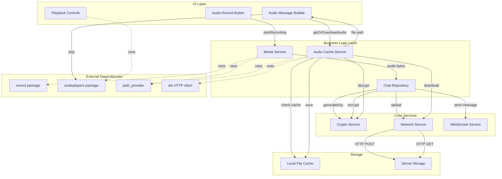
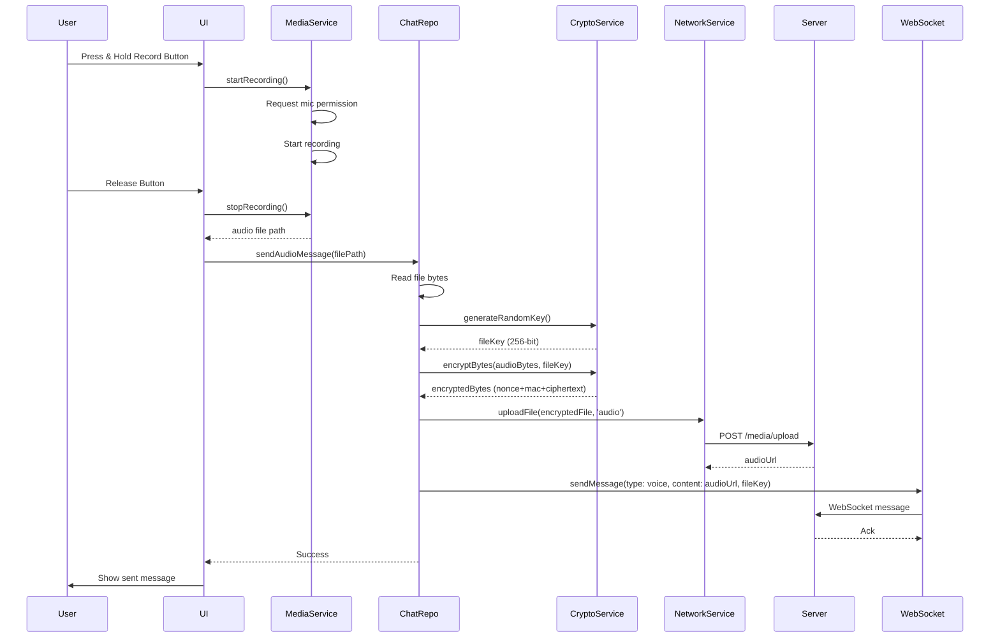
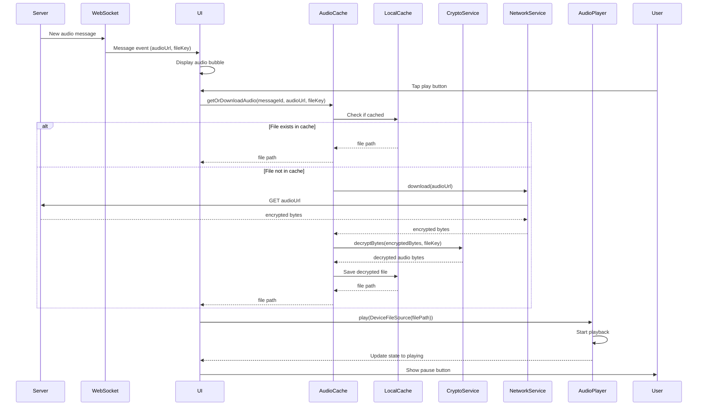
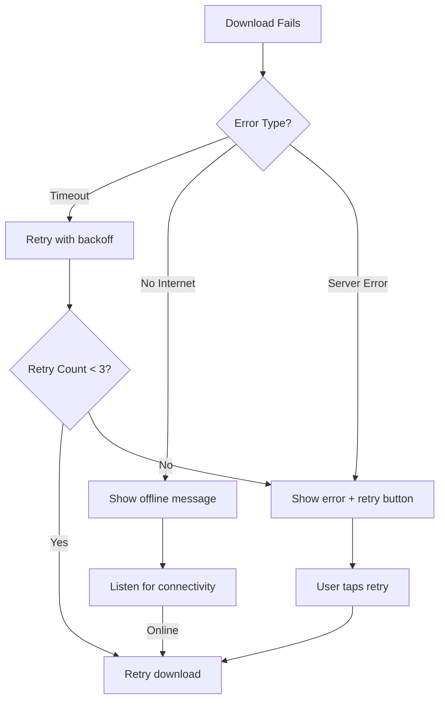
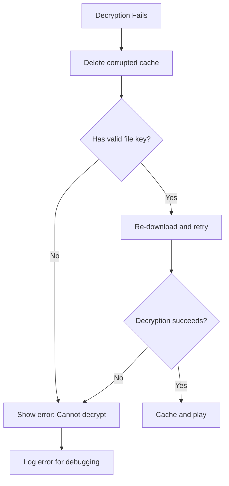

# Design Document: Encrypted Audio Messaging

## Overview

This design document specifies the implementation of end-to-end encrypted audio messaging for a Flutter chat application. The feature enables users to record, encrypt, send, receive, decrypt, and play audio messages with AES-GCM encryption.

The implementation introduces a new AudioCacheService for managing encrypted audio downloads and local caching, extends the existing MediaService for audio recording, modifies the ChatRepository for encrypted uploads, and creates new UI components for audio message display and playback.

### Key Design Principles

1. **Security First**: All audio files are encrypted with AES-GCM before upload; encryption keys are transmitted only through secure WebSocket connections
2. **Seamless Integration**: Leverage existing services (CryptoService, MediaService, NetworkService) to minimize code duplication
3. **User Experience**: Provide clear visual feedback for all states (recording, uploading, downloading, playing)
4. **Offline Support**: Cache decrypted audio files locally to avoid repeated downloads
5. **Error Resilience**: Handle network failures, decryption errors, and playback issues gracefully

## Architecture

### System Architecture Diagram



### Component Interaction Flow

#### Sending Audio Message Flow



#### Receiving and Playing Audio Message Flow



## Components and Interfaces

### 1. AudioCacheService

**Location**: `app/lib/core/media/audio_cache_service.dart`

**Purpose**: Manages downloading, decrypting, and caching audio files locally.

**Dependencies**:
- `CryptoService`: For decryption
- `dio`: For HTTP downloads
- `path_provider`: For cache directory access

**Interface**:

```dart
class AudioCacheService {
  final CryptoService _cryptoService;
  final Dio _dio;
  
  AudioCacheService(this._cryptoService, this._dio);
  
  /// Downloads, decrypts, and caches an audio file
  /// Returns the local file path of the decrypted audio
  /// Throws AudioCacheException on failure
  Future<String> getOrDownloadAudio({
    required String messageId,
    required String audioUrl,
    required String fileKey,
  });
  
  /// Checks if an audio file is already cached
  Future<bool> isCached(String messageId);
  
  /// Gets the cache file path for a message ID
  Future<String> _getCacheFilePath(String messageId);
  
  /// Downloads encrypted audio from URL
  Future<Uint8List> _downloadEncryptedAudio(String audioUrl);
  
  /// Decrypts audio bytes using the file key
  Future<Uint8List> _decryptAudio(Uint8List encryptedBytes, String fileKey);
  
  /// Saves decrypted audio to cache
  Future<String> _saveToCa che(String messageId, Uint8List audioBytes);
  
  /// Clears all cached audio files
  Future<void> clearCache();
  
  /// Gets total cache size in bytes
  Future<int> getCacheSize();
}
```

**Key Implementation Details**:

1. **Cache Directory**: Use `path_provider.getTemporaryDirectory()` for cache storage
2. **File Naming**: Use message ID as the basis for cache file names (e.g., `audio_{messageId}.m4a`)
3. **Cache Validation**: Check file existence before returning cached path
4. **Error Handling**: 
   - Network errors: Throw `AudioCacheException` with network error type
   - Decryption errors: Delete corrupted cache file and throw exception
   - File I/O errors: Throw exception with descriptive message

### 2. CryptoService Extensions

**Location**: `app/lib/core/crypto/crypto_service.dart` (extend existing)

**New Methods Required**:

```dart
class CryptoService {
  // ... existing methods ...
  
  /// Generates a random 256-bit AES key for file encryption
  Future<String> generateRandomKey();
  
  /// Encrypts bytes using AES-GCM with the provided key
  /// Returns: nonce (12 bytes) + MAC (16 bytes) + ciphertext
  Future<Uint8List> encryptBytes(Uint8List plainBytes, String keyBase64);
  
  /// Decrypts bytes using AES-GCM with the provided key
  /// Expects: nonce (12 bytes) + MAC (16 bytes) + ciphertext
  Future<Uint8List> decryptBytes(Uint8List encryptedBytes, String keyBase64);
}
```

**Implementation Notes**:
- Use `AesGcm.with256bits()` (already available in CryptoService)
- Generate random key using `SecureRandom` from cryptography package
- Format: `[nonce(12) | mac(16) | ciphertext]` (same as existing message encryption)
- Base64 encode keys for transmission

### 3. MediaService Extensions

**Location**: `app/lib/core/media/media_service.dart` (extend existing)

**New Methods Required**:

```dart
class MediaService {
  // ... existing methods ...
  
  /// Gets audio file bytes from a file path
  Future<Uint8List> getAudioBytes(String filePath);
  
  /// Validates audio file duration
  /// Returns true if duration is between 1 and 120 seconds
  Future<bool> validateAudioDuration(String filePath);
}
```

**Existing Methods to Use**:
- `startRecording(String path)`: Already implemented
- `stopRecording()`: Already implemented
- `getTemporaryAudioPath()`: Already implemented
- `hasMicrophonePermission()`: Already implemented

### 4. ChatRepository Extensions

**Location**: `app/lib/features/chat/repositories/chat_repository.dart` (extend existing)

**New Methods Required**:

```dart
class ChatRepository {
  // ... existing methods ...
  
  /// Sends an encrypted audio message
  /// 1. Generates random file key
  /// 2. Encrypts audio file
  /// 3. Uploads encrypted file
  /// 4. Sends message via WebSocket with URL and key
  Future<void> sendAudioMessage({
    required String roomId,
    required String audioFilePath,
    String? receiverId,
  });
  
  /// Helper: Encrypts and uploads audio file
  Future<String> _uploadEncryptedAudio(File audioFile, String fileKey);
}
```

**Integration with WebSocket**:
- Use existing WebSocket service to send message
- Message format:
  ```json
  {
    "type": "voice",
    "content": "https://server.com/uploads/encrypted_audio.m4a",
    "file_key": "base64_encoded_256bit_key",
    "room_id": "room123",
    "receiver_id": "user456" // optional, for DMs
  }
  ```

### 5. Audio Message Bubble UI

**Location**: `app/lib/features/chat/widgets/audio_message_bubble.dart` (new file)

**Purpose**: Displays audio messages with playback controls and state management.

**Interface**:

```dart
class AudioMessageBubble extends ConsumerStatefulWidget {
  final Message message;
  final bool isSentByMe;
  
  const AudioMessageBubble({
    required this.message,
    required this.isSentByMe,
  });
}

class _AudioMessageBubbleState extends ConsumerState<AudioMessageBubble> {
  AudioPlayer? _audioPlayer;
  AudioPlaybackState _playbackState = AudioPlaybackState.stopped;
  Duration _duration = Duration.zero;
  Duration _position = Duration.zero;
  bool _isLoading = false;
  String? _error;
  String? _cachedFilePath;
  
  @override
  void initState();
  
  @override
  void dispose();
  
  /// Handles play/pause button tap
  Future<void> _togglePlayback();
  
  /// Loads audio file from cache or downloads it
  Future<void> _loadAudio();
  
  /// Starts audio playback
  Future<void> _play();
  
  /// Pauses audio playback
  Future<void> _pause();
  
  /// Stops audio playback and resets position
  Future<void> _stop();
  
  /// Handles audio player completion
  void _onPlayerComplete();
  
  /// Handles audio player errors
  void _onPlayerError(String error);
  
  @override
  Widget build(BuildContext context);
}

enum AudioPlaybackState {
  stopped,
  playing,
  paused,
  loading,
  error,
}
```

**UI Components**:
1. **Play/Pause Button**: 
   - Stopped state: Play icon
   - Playing state: Pause icon
   - Paused state: Play icon
   - Loading state: CircularProgressIndicator
   - Error state: Error icon with retry option

2. **Progress Bar**: 
   - Shows current position and total duration
   - Allows seeking to different positions
   - Updates in real-time during playback

3. **Duration Display**: 
   - Format: "MM:SS / MM:SS" (current / total)
   - Shows "Loading..." during download/decrypt

4. **Error Display**:
   - Shows error message when download/decrypt/playback fails
   - Provides retry button

**State Management**:
- Use Riverpod for dependency injection (AudioCacheService, CryptoService)
- Local state for playback controls
- Listen to AudioPlayer events for position updates

### 6. Audio Record Button

**Location**: `app/lib/features/chat/widgets/audio_record_button.dart` (new file)

**Purpose**: Provides UI for recording audio messages.

**Interface**:

```dart
class AudioRecordButton extends ConsumerStatefulWidget {
  final Function(String audioFilePath) onRecordingComplete;
  final VoidCallback? onRecordingStart;
  final VoidCallback? onRecordingCancel;
  
  const AudioRecordButton({
    required this.onRecordingComplete,
    this.onRecordingStart,
    this.onRecordingCancel,
  });
}

class _AudioRecordButtonState extends ConsumerState<AudioRecordButton> {
  bool _isRecording = false;
  Duration _recordingDuration = Duration.zero;
  Timer? _timer;
  String? _recordingPath;
  
  /// Starts audio recording
  Future<void> _startRecording();
  
  /// Stops recording and returns file path
  Future<void> _stopRecording();
  
  /// Cancels recording and deletes file
  Future<void> _cancelRecording();
  
  /// Updates recording duration timer
  void _updateDuration();
  
  @override
  Widget build(BuildContext context);
}
```

**UI Behavior**:
1. **Long Press to Record**: Hold button to start recording
2. **Release to Send**: Release button to stop and send
3. **Slide to Cancel**: Slide finger left to cancel recording
4. **Duration Display**: Show recording duration in real-time
5. **Max Duration**: Auto-stop at 120 seconds
6. **Min Duration**: Require at least 1 second to send

## Data Models

### Message Model Extensions

**Location**: `app/lib/models/message.dart` (extend existing)

The existing `Message` model already supports `MessageType.voice`. We need to ensure the `content` field stores the audio URL and add a new field for the encryption key.

**Proposed Extension**:

```dart
class Message extends Equatable {
  // ... existing fields ...
  
  /// For encrypted audio/image/video messages
  /// Stores the symmetric encryption key (base64 encoded)
  final String? fileKey;
  
  const Message({
    // ... existing parameters ...
    this.fileKey,
  });
  
  factory Message.fromJson(Map<String, dynamic> json) {
    // ... existing parsing ...
    fileKey: json['file_key'],
  }
  
  Map<String, dynamic> toJson() {
    return {
      // ... existing fields ...
      'file_key': fileKey,
    };
  }
  
  Message copyWith({
    // ... existing parameters ...
    String? fileKey,
  }) {
    return Message(
      // ... existing fields ...
      fileKey: fileKey ?? this.fileKey,
    );
  }
}
```

**Note**: The `fileKey` field is optional to maintain backward compatibility with existing messages. Only audio (and potentially future encrypted media) messages will have this field populated.

### AudioCacheException

**Location**: `app/lib/core/media/audio_cache_service.dart`

```dart
enum AudioCacheErrorType {
  networkError,
  decryptionError,
  fileIOError,
  invalidFormat,
}

class AudioCacheException implements Exception {
  final AudioCacheErrorType type;
  final String message;
  final dynamic originalError;
  
  const AudioCacheException({
    required this.type,
    required this.message,
    this.originalError,
  });
  
  @override
  String toString() => 'AudioCacheException($type): $message';
}
```

## Data Flow

### Audio Message Sending Data Flow

```
User Input (Record Audio)
  ↓
MediaService.startRecording()
  ↓
MediaService.stopRecording() → audio file path
  ↓
File.readAsBytes() → Uint8List audioBytes
  ↓
CryptoService.generateRandomKey() → String fileKey
  ↓
CryptoService.encryptBytes(audioBytes, fileKey) → Uint8List encryptedBytes
  ↓
File.writeAsBytes(encryptedBytes) → File encryptedFile
  ↓
NetworkService.uploadFile(encryptedFile, 'audio') → String audioUrl
  ↓
WebSocketService.sendMessage({
  type: 'voice',
  content: audioUrl,
  file_key: fileKey,
  room_id: roomId
}) → Message sent
  ↓
UI Update (Show sent message bubble)
```

### Audio Message Receiving Data Flow

```
WebSocket Message Received
  ↓
Parse Message (type: voice, content: audioUrl, file_key: fileKey)
  ↓
Store in LocalDB
  ↓
UI Renders AudioMessageBubble
  ↓
User Taps Play Button
  ↓
AudioCacheService.getOrDownloadAudio(messageId, audioUrl, fileKey)
  ↓
Check LocalCache.exists(messageId)
  ├─ YES → Return cached file path
  └─ NO  → Continue download flow
       ↓
       Dio.download(audioUrl) → Uint8List encryptedBytes
       ↓
       CryptoService.decryptBytes(encryptedBytes, fileKey) → Uint8List audioBytes
       ↓
       File.writeAsBytes(audioBytes) → Save to cache
       ↓
       Return cached file path
  ↓
AudioPlayer.setSourceDeviceFile(filePath)
  ↓
AudioPlayer.play()
  ↓
UI Updates (Show pause button, update progress)
```


## Correctness Properties

*A property is a characteristic or behavior that should hold true across all valid executions of a system—essentially, a formal statement about what the system should do. Properties serve as the bridge between human-readable specifications and machine-verifiable correctness guarantees.*

### Property Reflection

After analyzing all acceptance criteria, I identified several areas of redundancy:

1. **Encryption Format Properties (2.4 & 2.5)**: Both test the same thing—that encrypted output has the correct structure. Combined into Property 2.
2. **Cache Behavior Properties (4.2, 4.3, 4.5, 4.6)**: These all relate to cache operations and can be validated through a comprehensive cache round-trip property. Kept separate for clarity but noted the relationship.
3. **State Display Properties (8.2, 8.3, 8.4)**: These are examples of UI state mapping, not universal properties. Kept as examples.
4. **Error Type Properties (9.1, 9.2, 9.3, 9.4)**: Each tests a different error type, so all are necessary.

### Property 1: Audio Encryption Round-Trip

*For any* valid audio file bytes and generated file key, encrypting then decrypting the bytes should produce the original audio data.

**Validates: Requirements 2.2, 4.4**

### Property 2: Encrypted Audio Format

*For any* audio file encrypted by CryptoService, the encrypted bytes should have the format: nonce (12 bytes) + MAC (16 bytes) + ciphertext, and the total length should be at least 28 bytes.

**Validates: Requirements 2.4, 2.5**

### Property 3: File Key Length

*For any* file key generated by CryptoService.generateRandomKey(), the key should be exactly 256 bits (32 bytes) in length.

**Validates: Requirements 2.3**

### Property 4: Recording Duration Validation

*For any* audio recording, if the duration is between 1 and 120 seconds (inclusive), the MediaService should accept it; if outside this range, it should reject it.

**Validates: Requirements 1.3**

### Property 5: Upload Returns Valid URL

*For any* successfully uploaded encrypted audio file, the NetworkService should return a non-empty URL string that starts with "http://" or "https://".

**Validates: Requirements 3.2**

### Property 6: Message Contains URL and Key

*For any* audio message sent via WebSocket, the message should contain both a non-empty audio URL in the content field and a non-empty file key in the file_key field.

**Validates: Requirements 3.3**

### Property 7: Cache Hit Avoids Download

*For any* message ID that exists in the local cache, calling getOrDownloadAudio should return the cached file path without making a network request.

**Validates: Requirements 4.1, 4.2**

### Property 8: Cache Miss Triggers Download

*For any* message ID that does not exist in the local cache, calling getOrDownloadAudio should trigger a network download of the encrypted audio file.

**Validates: Requirements 4.3**

### Property 9: Cache File Naming

*For any* message ID, the cached audio file path should contain or be derived from the message ID, ensuring unique cache entries per message.

**Validates: Requirements 7.2**

### Property 10: Cache File Existence Validation

*For any* message ID, if the AudioCacheService reports a file as cached, then the file should exist at the returned path and be readable.

**Validates: Requirements 7.3**

### Property 11: Decryption Failure Cleanup

*For any* encrypted audio file that fails decryption, the AudioCacheService should delete any partially cached file and return a decryption error.

**Validates: Requirements 4.8**

### Property 12: Upload Failure Prevents Message Send

*For any* audio file where upload fails, the ChatRepository should not send a WebSocket message and should return an error.

**Validates: Requirements 3.4**

### Property 13: Playback State Transitions

*For any* audio player, the state transitions should follow valid paths: stopped→playing, playing→paused, paused→playing, playing→stopped, and paused→stopped. Invalid transitions (e.g., stopped→paused) should not occur.

**Validates: Requirements 8.1, 8.5, 8.6, 8.7**

### Property 14: Stopped to Playing Resets Position

*For any* audio player transitioning from stopped to playing state, the playback position should start at 0 (beginning of audio).

**Validates: Requirements 8.5**

### Property 15: Paused to Playing Preserves Position

*For any* audio player transitioning from paused to playing state, the playback position should remain at the position where it was paused.

**Validates: Requirements 8.6**

### Property 16: Playing to Paused Preserves Position

*For any* audio player transitioning from playing to paused state, the playback position should be preserved and not reset.

**Validates: Requirements 8.7**

### Property 17: Completion Triggers Callback

*For any* audio playback that completes naturally (reaches the end), the onPlayerComplete callback should be triggered exactly once.

**Validates: Requirements 6.4**

### Property 18: Completion Resets State

*For any* audio message bubble, when the onPlayerComplete callback is triggered, the playback state should transition to stopped.

**Validates: Requirements 6.5**

### Property 19: Error Type Correctness - Network

*For any* download operation that fails due to network issues (timeout, connection refused, no internet), the AudioCacheService should return an AudioCacheException with type networkError.

**Validates: Requirements 9.1**

### Property 20: Error Type Correctness - Decryption

*For any* decryption operation that fails due to an invalid or incorrect file key, the AudioCacheService should return an AudioCacheException with type decryptionError.

**Validates: Requirements 9.2**

### Property 21: Error Type Correctness - Permission

*For any* recording attempt when microphone permission is denied, the MediaService should return an error indicating permission denial.

**Validates: Requirements 9.4**

### Property 22: Encryption Security

*For any* encrypted audio file, attempting to decrypt it with an incorrect file key should fail and not produce the original audio data.

**Validates: Requirements 10.1**

### Property 23: Cache Storage Location

*For any* cached audio file, the file path should be within the directory returned by path_provider's getTemporaryDirectory().

**Validates: Requirements 7.1**

### Property 24: Cache Does Not Store Keys

*For any* cached audio file, the file contents should be decrypted audio data and should not contain the file key in any form.

**Validates: Requirements 10.4**

### Property 25: Seek Position Update

*For any* audio player, calling seek to a valid position should update the current playback position to the requested position (within a small tolerance).

**Validates: Requirements 6.6**

## Error Handling

### Error Categories

The system handles four primary categories of errors:

1. **Recording Errors**
   - Permission denied
   - Microphone unavailable
   - Recording duration invalid
   - File system errors

2. **Encryption/Decryption Errors**
   - Key generation failure
   - Encryption failure
   - Decryption failure (invalid key, corrupted data)
   - Invalid format

3. **Network Errors**
   - Upload failure
   - Download failure
   - Timeout
   - Connection refused

4. **Playback Errors**
   - File not found
   - Corrupted audio file
   - Unsupported format
   - Player initialization failure

### Error Handling Strategy

#### MediaService Error Handling

```dart
class MediaServiceException implements Exception {
  final MediaErrorType type;
  final String message;
  
  const MediaServiceException(this.type, this.message);
}

enum MediaErrorType {
  permissionDenied,
  recordingFailed,
  invalidDuration,
  fileSystemError,
}
```

**Handling**:
- Permission errors: Show permission request dialog with explanation
- Recording errors: Display error message and allow retry
- Duration errors: Provide feedback about min/max duration requirements
- File system errors: Log error and show generic error message

#### AudioCacheService Error Handling

```dart
class AudioCacheException implements Exception {
  final AudioCacheErrorType type;
  final String message;
  final dynamic originalError;
  
  const AudioCacheException({
    required this.type,
    required this.message,
    this.originalError,
  });
}

enum AudioCacheErrorType {
  networkError,
  decryptionError,
  fileIOError,
  invalidFormat,
}
```

**Handling**:
- Network errors: Show retry button, cache error for offline retry
- Decryption errors: Delete corrupted cache, show error message
- File I/O errors: Attempt cache cleanup, show error message
- Invalid format errors: Log error, show unsupported format message

#### ChatRepository Error Handling

**Upload Failures**:
- Retry logic: Attempt upload up to 3 times with exponential backoff
- Fallback: Store message locally with "pending" status for later retry
- User feedback: Show "sending..." indicator, then "failed" with retry option

**WebSocket Failures**:
- Queue messages locally when WebSocket is disconnected
- Retry sending when connection is restored
- Show connection status indicator in UI

#### AudioPlayer Error Handling

**Playback Failures**:
- File not found: Re-download from cache service
- Corrupted file: Delete cache and re-download
- Unsupported format: Show error message (should not happen with m4a)
- Player errors: Log error, show generic playback error message

### Error Recovery Flows

#### Network Failure Recovery



#### Decryption Failure Recovery



### User-Facing Error Messages

| Error Type | User Message | Action |
|------------|--------------|--------|
| Permission Denied | "Microphone permission is required to record audio messages" | Open Settings button |
| Recording Failed | "Failed to record audio. Please try again." | Retry button |
| Upload Failed | "Failed to send audio message. Check your connection." | Retry button |
| Download Failed | "Failed to load audio message. Tap to retry." | Retry button |
| Decryption Failed | "Cannot play this audio message. It may be corrupted." | None (log for debugging) |
| Playback Failed | "Failed to play audio. The file may be corrupted." | Retry button |
| Invalid Duration | "Audio must be between 1 and 120 seconds" | Dismiss |

## Testing Strategy

### Dual Testing Approach

This feature requires both unit tests and property-based tests to ensure comprehensive coverage:

**Unit Tests** focus on:
- Specific examples of encryption/decryption
- Edge cases (empty files, max duration, min duration)
- Error conditions (permission denied, network failures)
- UI widget rendering and state
- Integration points between components

**Property-Based Tests** focus on:
- Universal properties that hold for all inputs
- Round-trip properties (encrypt/decrypt, upload/download)
- State transition validity
- Invariants (file format, key length, cache consistency)

### Property-Based Testing Configuration

**Framework**: Use `fast_check` (Dart port) or implement generators using the `test` package with randomized inputs.

**Configuration**:
- Minimum 100 iterations per property test
- Use seed-based randomization for reproducibility
- Tag each test with the property it validates

**Tag Format**:
```dart
test('Property 1: Audio Encryption Round-Trip', () {
  // Feature: encrypted-audio-messaging, Property 1: For any valid audio file bytes and generated file key, encrypting then decrypting the bytes should produce the original audio data.
  
  for (int i = 0; i < 100; i++) {
    // Generate random audio bytes
    final audioBytes = generateRandomBytes(1024 + Random().nextInt(10000));
    final fileKey = await cryptoService.generateRandomKey();
    
    // Encrypt then decrypt
    final encrypted = await cryptoService.encryptBytes(audioBytes, fileKey);
    final decrypted = await cryptoService.decryptBytes(encrypted, fileKey);
    
    // Should match original
    expect(decrypted, equals(audioBytes));
  }
});
```

### Test Data Generators

**Audio Bytes Generator**:
```dart
Uint8List generateRandomAudioBytes({int minSize = 1024, int maxSize = 1024 * 1024}) {
  final size = minSize + Random().nextInt(maxSize - minSize);
  return Uint8List.fromList(List.generate(size, (_) => Random().nextInt(256)));
}
```

**File Key Generator**:
```dart
String generateRandomFileKey() {
  final bytes = List.generate(32, (_) => Random().nextInt(256));
  return base64Encode(bytes);
}
```

**Message ID Generator**:
```dart
String generateRandomMessageId() {
  return List.generate(24, (_) => Random().nextInt(16).toRadixString(16)).join();
}
```

**Audio URL Generator**:
```dart
String generateRandomAudioUrl() {
  final id = generateRandomMessageId();
  return 'https://example.com/uploads/audio_$id.m4a';
}
```

### Unit Test Coverage

#### CryptoService Tests
- ✓ Generate random key returns 256-bit key
- ✓ Encrypt bytes produces correct format
- ✓ Decrypt bytes with correct key succeeds
- ✓ Decrypt bytes with wrong key fails
- ✓ Encrypt/decrypt round-trip preserves data
- ✓ Encrypted output is different from input

#### MediaService Tests
- ✓ Start recording with permission succeeds
- ✓ Start recording without permission fails
- ✓ Stop recording returns audio file path
- ✓ Recording duration validation (1s min, 120s max)
- ✓ Get audio bytes from file path

#### AudioCacheService Tests
- ✓ Cache hit returns local path without download
- ✓ Cache miss triggers download
- ✓ Downloaded file is decrypted and cached
- ✓ Cache file naming uses message ID
- ✓ Decryption failure deletes corrupted cache
- ✓ Network failure returns network error
- ✓ Invalid key returns decryption error
- ✓ Cache directory is temporary directory
- ✓ Cached files do not contain encryption keys

#### ChatRepository Tests
- ✓ Send audio message generates file key
- ✓ Send audio message encrypts audio
- ✓ Send audio message uploads encrypted file
- ✓ Send audio message sends WebSocket message with URL and key
- ✓ Upload failure prevents WebSocket send
- ✓ Upload failure returns error

#### AudioMessageBubble Tests
- ✓ Initial state shows play button
- ✓ Loading state shows progress indicator
- ✓ Playing state shows pause button
- ✓ Paused state shows play button
- ✓ Error state shows error message and retry button
- ✓ Tap play loads audio from cache service
- ✓ Tap play starts playback
- ✓ Tap pause pauses playback
- ✓ Playback completion resets to stopped state
- ✓ Duration display updates during playback

#### AudioRecordButton Tests
- ✓ Long press starts recording
- ✓ Release stops recording and calls callback
- ✓ Slide to cancel deletes recording
- ✓ Duration display updates during recording
- ✓ Auto-stop at 120 seconds
- ✓ Minimum 1 second to send

### Property-Based Test Coverage

Each property from the Correctness Properties section should have a corresponding property-based test:

- Property 1: Audio Encryption Round-Trip (100+ iterations)
- Property 2: Encrypted Audio Format (100+ iterations)
- Property 3: File Key Length (100+ iterations)
- Property 4: Recording Duration Validation (100+ iterations)
- Property 5: Upload Returns Valid URL (100+ iterations)
- Property 6: Message Contains URL and Key (100+ iterations)
- Property 7: Cache Hit Avoids Download (100+ iterations)
- Property 8: Cache Miss Triggers Download (100+ iterations)
- Property 9: Cache File Naming (100+ iterations)
- Property 10: Cache File Existence Validation (100+ iterations)
- Property 11: Decryption Failure Cleanup (100+ iterations)
- Property 12: Upload Failure Prevents Message Send (100+ iterations)
- Property 13: Playback State Transitions (100+ iterations)
- Property 14-16: Position Preservation Properties (100+ iterations each)
- Property 17-18: Completion Properties (100+ iterations each)
- Property 19-21: Error Type Properties (100+ iterations each)
- Property 22: Encryption Security (100+ iterations)
- Property 23: Cache Storage Location (100+ iterations)
- Property 24: Cache Does Not Store Keys (100+ iterations)
- Property 25: Seek Position Update (100+ iterations)

### Integration Tests

**End-to-End Audio Message Flow**:
1. Record audio → encrypt → upload → send message
2. Receive message → download → decrypt → cache → play
3. Verify audio playback matches original recording

**Cache Persistence Test**:
1. Download and cache audio
2. Restart app (simulate)
3. Verify cached audio is still available

**Offline Behavior Test**:
1. Receive audio message while online
2. Go offline
3. Verify cached audio still plays
4. Verify new audio shows appropriate error

### Widget Tests

**AudioMessageBubble Widget**:
- Render in all states (stopped, playing, paused, loading, error)
- Verify button icons match state
- Verify progress bar updates
- Verify duration display
- Verify error message display

**AudioRecordButton Widget**:
- Render in idle and recording states
- Verify long press behavior
- Verify slide to cancel gesture
- Verify duration display during recording

### Performance Tests

**Large File Handling**:
- Test with audio files up to 120 seconds (max duration)
- Verify encryption/decryption performance
- Verify upload/download performance
- Verify memory usage stays reasonable

**Cache Management**:
- Test with many cached files (100+)
- Verify cache lookup performance
- Verify cache cleanup doesn't block UI

### Security Tests

**Encryption Validation**:
- Verify encrypted data is not readable without key
- Verify different keys produce different ciphertext
- Verify MAC validation prevents tampering
- Verify nonce is unique for each encryption

**Key Handling**:
- Verify keys are not logged
- Verify keys are not stored in cache
- Verify keys are transmitted only via WebSocket
- Verify key generation uses secure random

## Implementation Guidance

### Phase 1: Core Services (AudioCacheService & CryptoService Extensions)

**Priority**: High  
**Estimated Effort**: 2-3 days

1. **Extend CryptoService**:
   - Add `generateRandomKey()` method
   - Add `encryptBytes()` method
   - Add `decryptBytes()` method
   - Write unit tests for each method
   - Write property-based tests for round-trip

2. **Implement AudioCacheService**:
   - Create service class with dependency injection
   - Implement cache directory management
   - Implement `getOrDownloadAudio()` method
   - Implement download logic with Dio
   - Implement decryption integration
   - Implement cache file management
   - Write comprehensive unit tests
   - Write property-based tests for cache behavior

3. **Testing**:
   - Verify encryption/decryption round-trip
   - Verify cache hit/miss behavior
   - Verify error handling for all error types
   - Verify cache file naming and storage location

### Phase 2: Repository Extensions (ChatRepository & MediaService)

**Priority**: High  
**Estimated Effort**: 2-3 days

1. **Extend MediaService**:
   - Add `getAudioBytes()` method
   - Add `validateAudioDuration()` method (if needed)
   - Write unit tests

2. **Extend ChatRepository**:
   - Add `sendAudioMessage()` method
   - Implement encryption workflow
   - Implement upload workflow
   - Implement WebSocket message sending
   - Add error handling and retry logic
   - Write unit tests
   - Write integration tests

3. **Extend Message Model**:
   - Add `fileKey` field
   - Update `fromJson()` and `toJson()` methods
   - Update `toMap()` and `fromMap()` for SQLite
   - Ensure backward compatibility

4. **Testing**:
   - Verify end-to-end send flow
   - Verify upload failure handling
   - Verify message format correctness

### Phase 3: UI Components (AudioMessageBubble & AudioRecordButton)

**Priority**: Medium  
**Estimated Effort**: 3-4 days

1. **Implement AudioMessageBubble**:
   - Create stateful widget
   - Implement state management (stopped, playing, paused, loading, error)
   - Integrate AudioCacheService
   - Integrate AudioPlayer
   - Implement playback controls
   - Implement progress bar and seeking
   - Implement error display and retry
   - Write widget tests
   - Write integration tests

2. **Implement AudioRecordButton**:
   - Create stateful widget
   - Implement long-press gesture detection
   - Implement slide-to-cancel gesture
   - Integrate MediaService
   - Implement recording duration display
   - Implement min/max duration validation
   - Write widget tests

3. **Integrate into Chat UI**:
   - Add AudioRecordButton to message input area
   - Update message list to render AudioMessageBubble for voice messages
   - Handle message type detection
   - Update UI layouts

4. **Testing**:
   - Verify all UI states render correctly
   - Verify gesture handling
   - Verify playback controls work
   - Verify error states and retry functionality

### Phase 4: Error Handling & Polish

**Priority**: Medium  
**Estimated Effort**: 1-2 days

1. **Implement Comprehensive Error Handling**:
   - Add user-friendly error messages
   - Implement retry logic
   - Add offline detection and handling
   - Add permission request flows

2. **Add Loading States**:
   - Show progress during upload
   - Show progress during download
   - Show progress during encryption/decryption

3. **Performance Optimization**:
   - Optimize cache lookup
   - Implement cache size limits
   - Implement cache cleanup strategy
   - Optimize audio player initialization

4. **Accessibility**:
   - Add semantic labels for screen readers
   - Ensure keyboard navigation works
   - Add haptic feedback for recording
   - Ensure color contrast meets WCAG standards

### Phase 5: Testing & Documentation

**Priority**: High  
**Estimated Effort**: 2-3 days

1. **Complete Test Coverage**:
   - Write all property-based tests
   - Write all unit tests
   - Write integration tests
   - Write widget tests
   - Achieve >80% code coverage

2. **Manual Testing**:
   - Test on iOS and Android
   - Test with various audio durations
   - Test with poor network conditions
   - Test with permission denied scenarios
   - Test cache behavior across app restarts

3. **Documentation**:
   - Document API interfaces
   - Document error codes and handling
   - Document testing approach
   - Create user guide for audio messaging

### Development Best Practices

1. **Dependency Injection**: Use Riverpod providers for all services
2. **Error Handling**: Use typed exceptions with clear error messages
3. **Logging**: Add debug logging for all major operations
4. **Testing**: Write tests before or alongside implementation (TDD)
5. **Code Review**: Review all code for security implications
6. **Performance**: Profile encryption/decryption performance
7. **Security**: Never log encryption keys or sensitive data

### Security Considerations

1. **Key Management**:
   - Generate keys using cryptographically secure random
   - Never log or persist file keys
   - Transmit keys only via secure WebSocket

2. **File Storage**:
   - Store only decrypted files in cache
   - Use temporary directory for cache (auto-cleaned by OS)
   - Validate file paths to prevent directory traversal

3. **Network Security**:
   - Use HTTPS for all uploads/downloads
   - Validate server certificates
   - Implement certificate pinning (optional)

4. **Input Validation**:
   - Validate audio file format
   - Validate file size limits
   - Validate message IDs and URLs
   - Sanitize file paths

### Performance Considerations

1. **Encryption/Decryption**:
   - Perform on background isolate for large files
   - Show progress indicator for operations >1 second
   - Cache decrypted files to avoid repeated decryption

2. **Network Operations**:
   - Implement connection pooling
   - Use compression for uploads (if supported)
   - Implement resumable uploads for large files
   - Cache downloaded files aggressively

3. **UI Responsiveness**:
   - Never block UI thread with crypto operations
   - Use async/await properly
   - Show loading states immediately
   - Debounce rapid user interactions

4. **Memory Management**:
   - Stream large files instead of loading entirely into memory
   - Dispose audio players when not in use
   - Implement cache size limits
   - Clean up temporary files

### Deployment Checklist

- [ ] All unit tests passing
- [ ] All property-based tests passing
- [ ] All integration tests passing
- [ ] Code coverage >80%
- [ ] Manual testing on iOS completed
- [ ] Manual testing on Android completed
- [ ] Performance profiling completed
- [ ] Security review completed
- [ ] Documentation completed
- [ ] Error messages reviewed for clarity
- [ ] Accessibility testing completed
- [ ] Backend API endpoints verified
- [ ] WebSocket message format verified
- [ ] Server-side encryption key handling verified

