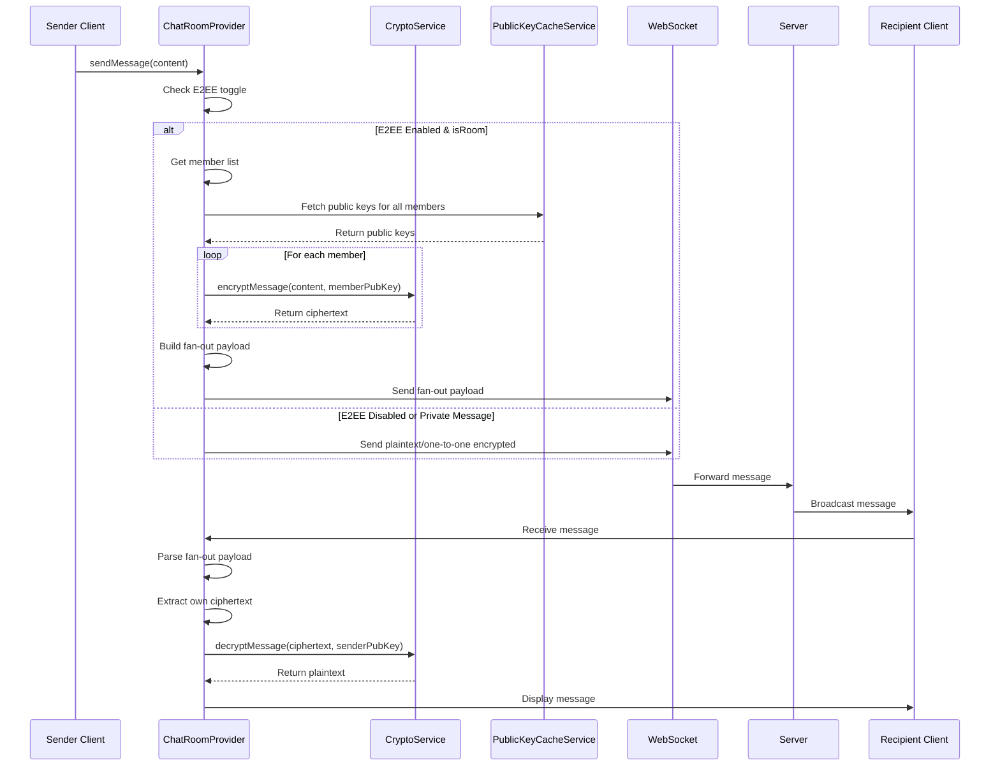
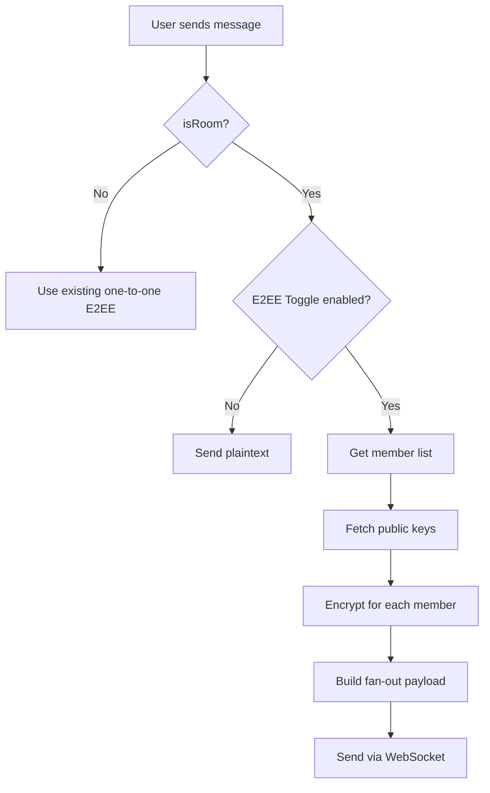

# Design Document: Group Chat Fan-out E2EE

## Overview

This design implements Client-Side Fan-out End-to-End Encryption (E2EE) for group chats in the Flutter messaging system. The fan-out strategy encrypts each message individually for every group member using their public keys, ensuring zero-knowledge server architecture where the server cannot decrypt any message content.

The implementation extends the existing one-to-one E2EE infrastructure (X25519 + AES-GCM) to support group chats with up to 50 members while maintaining backward compatibility with plaintext messages and existing private message encryption.

### Key Design Principles

- Zero-knowledge architecture: All encryption/decryption happens client-side
- Unique ciphertext per recipient: Each member receives a distinct encrypted copy
- Transparent user experience: Encryption works seamlessly without user intervention
- Performance-conscious: Asynchronous operations to avoid UI blocking
- Backward compatible: Supports mixed plaintext/encrypted message history
- Reuses existing crypto primitives: Leverages CryptoService for all operations

## Architecture

### High-Level Flow




### Component Integration

The fan-out E2EE feature integrates with existing components:

1. **ChatRoomProvider**: Main orchestrator for encryption/decryption logic
   - Determines when to apply fan-out encryption (isRoom + E2EE enabled)
   - Manages member list retrieval and public key fetching
   - Constructs and parses fan-out payloads
   - Handles encryption/decryption errors gracefully

2. **CryptoService**: Provides cryptographic primitives
   - `encryptMessage(plaintext, publicKey)`: Encrypts for a single recipient
   - `decryptMessage(ciphertext, publicKey)`: Decrypts using sender's public key
   - Uses X25519 for ECDH key exchange
   - Uses AES-GCM for symmetric encryption

3. **PublicKeyCacheService**: Manages public key retrieval and caching
   - Three-tier caching: memory → SQLite → API
   - Deduplicates concurrent requests for same user
   - Returns null for unavailable keys (graceful degradation)

4. **WebSocketService**: Handles message transport
   - Sends fan-out payloads as JSON strings
   - Receives encrypted messages from server
   - No changes required (transport-agnostic)

### Encryption Decision Tree




## Components and Interfaces

### ChatRoomProvider Extensions

The ChatRoomProvider will be extended with the following methods:

```dart
// New method: Encrypt message using fan-out strategy
Future<String> _encryptGroupMessage(String plaintext, List<String> memberIds) async {
  final ciphertexts = <String, String>{};
  
  for (final memberId in memberIds) {
    final publicKey = await _publicKeyCacheService.getPublicKey(memberId);
    if (publicKey != null) {
      try {
        final ciphertext = await _cryptoService.encryptMessage(plaintext, publicKey);
        ciphertexts[memberId] = ciphertext;
      } catch (e) {
        debugPrint('Failed to encrypt for member $memberId: $e');
        // Continue with other members
      }
    }
  }
  
  if (ciphertexts.isEmpty) {
    throw Exception('Failed to encrypt for any group member');
  }
  
  final fanoutPayload = {
    'is_fanout': true,
    'ciphertexts': ciphertexts,
  };
  
  return jsonEncode(fanoutPayload);
}

// New method: Decrypt fan-out message
Future<String> _decryptGroupMessage(String content, String senderId) async {
  try {
    final payload = jsonDecode(content);
    
    if (payload is! Map || payload['is_fanout'] != true) {
      return content; // Not a fan-out message, return as-is
    }
    
    final ciphertexts = payload['ciphertexts'] as Map<String, dynamic>?;
    if (ciphertexts == null) {
      return '🔒 訊息格式錯誤';
    }
    
    final myCiphertext = ciphertexts[arg.currentUserId];
    if (myCiphertext == null) {
      return '🔒 此訊息不包含您的加密內容';
    }
    
    final senderPublicKey = await _publicKeyCacheService.getPublicKey(senderId);
    if (senderPublicKey == null) {
      return '🔒 此訊息無法解密（金鑰已更新）';
    }
    
    final plaintext = await _cryptoService.decryptMessage(
      myCiphertext.toString(),
      senderPublicKey,
    );
    
    return plaintext;
  } catch (e) {
    debugPrint('Failed to decrypt group message: $e');
    return '🔒 此訊息無法解密（金鑰已更新）';
  }
}

// Modified: _tryDecryptMessage to handle both one-to-one and group messages
Future<Message> _tryDecryptMessage(Message m) async {
  if (m.isUnsent || m.content.isEmpty) return m;

  final isE2EEEnabled = ref.read(e2eeEnabledProvider(arg.roomId)).value ?? true;
  if (!isE2EEEnabled) return m;

  if (arg.isRoom) {
    // Group message: try fan-out decryption
    final decrypted = await _decryptGroupMessage(m.content, m.senderId);
    if (decrypted != m.content) {
      return m.copyWith(content: decrypted);
    }
    return m;
  } else {
    // Private message: use existing one-to-one logic
    final opponentId = (m.senderId == arg.currentUserId) ? m.receiverId : m.senderId;
    if (opponentId == null) return m;

    final pubKey = await _getPublicKey(opponentId);
    if (pubKey == null) return m;

    final decrypted = await _cryptoService.decryptMessage(m.content, pubKey);
    if (decrypted != m.content) {
      return m.copyWith(content: decrypted);
    }

    final looksLikeCiphertext = _looksLikeE2EECiphertext(m.content);
    if (looksLikeCiphertext) {
      return m.copyWith(content: '🔒 此訊息無法解密（金鑰已更新）');
    }
    return m;
  }
}
```


### Modified sendMessage Method

```dart
Future<void> sendMessage(
  String content, {
  MessageType type = MessageType.text,
  dynamic linkPreview,
}) async {
  final clientMsgId = const Uuid().v4();
  final replyToId = state.replyingToMessage?.id;
  
  // Create optimistic message
  final tempMessage = Message(
    id: clientMsgId,
    clientMsgId: clientMsgId,
    content: content,
    senderId: arg.currentUserId,
    receiverId: arg.isRoom ? null : arg.roomId,
    roomId: arg.isRoom ? arg.roomId : null,
    replyToMessageId: replyToId,
    replyToMessage: state.replyingToMessage,
    reactions: null,
    isUnsent: false,
    type: type,
    createdAt: DateTime.now(),
    isRead: true,
    status: MessageStatus.pending,
    readBy: [arg.currentUserId],
    linkPreview: linkPreview,
  );

  await LocalDbService().insertMessages([tempMessage]);
  _addMessage(tempMessage);
  state = state.copyWith(isSending: true, clearReplyingTo: true);

  String payloadContent = content;
  final isE2EEEnabled = ref.read(e2eeEnabledProvider(arg.roomId)).value ?? true;

  if (isE2EEEnabled) {
    if (arg.isRoom) {
      // Group message: use fan-out encryption
      try {
        final members = await _chatRepository.getRoomMemberProfiles(arg.roomId);
        final memberIds = members.map((m) => m.id).toList();
        payloadContent = await _encryptGroupMessage(content, memberIds);
      } catch (e) {
        debugPrint('Failed to encrypt group message: $e');
        state = state.copyWith(
          isSending: false,
          error: '加密失敗，無法發送訊息',
        );
        return;
      }
    } else {
      // Private message: use existing one-to-one encryption
      final pubKey = await _getPublicKey(arg.roomId);
      if (pubKey != null) {
        try {
          payloadContent = await _cryptoService.encryptMessage(content, pubKey);
        } catch (e) {
          debugPrint('Failed to encrypt message: $e');
        }
      }
    }
  }

  final payload = {
    'receiver_id': arg.isRoom ? null : arg.roomId,
    'room_id': arg.isRoom ? arg.roomId : null,
    'reply_to_message_id': replyToId,
    'content': payloadContent,
    'type': type.toString().split('.').last,
    'client_msg_id': clientMsgId,
    if (linkPreview != null) 'link_preview': {
      'url': linkPreview.url,
      'title': linkPreview.title,
      'description': linkPreview.description,
      if (linkPreview.imageUrl != null) 'image_url': linkPreview.imageUrl,
    },
  };

  try {
    await _wsService.send('chat_message', payload);
    _updateMessageStatus(clientMsgId, MessageStatus.sent);
    final sentMsg = tempMessage.copyWith(status: MessageStatus.sent);
    Future.microtask(() => LocalDbService().insertMessages([sentMsg]));
    state = state.copyWith(isSending: false);
  } catch (e) {
    debugPrint('⚠️ WS send failed, message kept as pending: $e');
    state = state.copyWith(isSending: false);
  }
}
```


### Modified resendPendingMessages Method

```dart
Future<void> resendPendingMessages() async {
  final pending = await LocalDbService().getPendingMessages();
  if (pending.isEmpty) return;

  for (final message in pending) {
    final isRelevant = (arg.isRoom && message.roomId == arg.roomId) ||
        (!arg.isRoom && (message.receiverId == arg.roomId || message.senderId == arg.roomId));

    if (!isRelevant) continue;

    String payloadContent = message.content;
    final isE2EEEnabled = ref.read(e2eeEnabledProvider(arg.roomId)).value ?? true;

    if (isE2EEEnabled) {
      if (arg.isRoom) {
        // Group message: use fan-out encryption
        try {
          final members = await _chatRepository.getRoomMemberProfiles(arg.roomId);
          final memberIds = members.map((m) => m.id).toList();
          payloadContent = await _encryptGroupMessage(message.content, memberIds);
        } catch (e) {
          debugPrint('Failed to encrypt pending group message: $e');
          continue;
        }
      } else {
        // Private message: use existing one-to-one encryption
        final pubKey = await _getPublicKey(arg.roomId);
        if (pubKey != null) {
          try {
            payloadContent = await _cryptoService.encryptMessage(message.content, pubKey);
          } catch (e) {
            debugPrint('Failed to encrypt pending message: $e');
            continue;
          }
        }
      }
    }

    final payload = {
      'receiver_id': message.receiverId,
      'room_id': message.roomId,
      'reply_to_message_id': message.replyToMessageId,
      'content': payloadContent,
      'type': message.type.name,
      'client_msg_id': message.clientMsgId,
      if (message.linkPreview != null) 'link_preview': {
        'url': message.linkPreview!.url,
        'title': message.linkPreview!.title,
        'description': message.linkPreview!.description,
        if (message.linkPreview!.imageUrl != null) 'image_url': message.linkPreview!.imageUrl,
      },
    };

    try {
      await _wsService.send('chat_message', payload);
      _updateMessageStatus(message.clientMsgId!, MessageStatus.sent);
      await LocalDbService().updateMessageStatus(message.clientMsgId!, MessageStatus.sent);
    } catch (e) {
      debugPrint('Failed to resend pending message ${message.clientMsgId}: $e');
    }
  }
}
```

### Modified retrySend Method

```dart
Future<void> retrySend(Message message) async {
  if (message.clientMsgId == null || message.clientMsgId!.isEmpty) return;
  
  final clientMsgId = message.clientMsgId!;
  _updateMessageStatus(clientMsgId, MessageStatus.sending);

  String payloadContent = message.content;
  final isE2EEEnabled = ref.read(e2eeEnabledProvider(arg.roomId)).value ?? true;

  if (isE2EEEnabled) {
    if (arg.isRoom) {
      // Group message: use fan-out encryption
      try {
        final members = await _chatRepository.getRoomMemberProfiles(arg.roomId);
        final memberIds = members.map((m) => m.id).toList();
        payloadContent = await _encryptGroupMessage(message.content, memberIds);
      } catch (e) {
        debugPrint('Failed to encrypt retry group message: $e');
        _updateMessageStatus(clientMsgId, MessageStatus.failed);
        state = state.copyWith(error: '加密失敗');
        return;
      }
    } else {
      // Private message: use existing one-to-one encryption
      final pubKey = await _getPublicKey(arg.roomId);
      if (pubKey != null) {
        try {
          payloadContent = await _cryptoService.encryptMessage(message.content, pubKey);
        } catch (e) {
          debugPrint('Failed to encrypt retry: $e');
        }
      }
    }
  }

  final payload = {
    'receiver_id': message.receiverId,
    'room_id': message.roomId,
    'reply_to_message_id': message.replyToMessageId,
    'content': payloadContent,
    'type': message.type.toString().split('.').last,
    'client_msg_id': clientMsgId,
    if (message.linkPreview != null) 'link_preview': {
      'url': message.linkPreview!.url,
      'title': message.linkPreview!.title,
      'description': message.linkPreview!.description,
      if (message.linkPreview!.imageUrl != null) 'image_url': message.linkPreview!.imageUrl,
    },
  };
  
  try {
    await _wsService.send('chat_message', payload);
    _updateMessageStatus(clientMsgId, MessageStatus.sent);
    Future.microtask(() => LocalDbService().insertMessages([message]));
    state = state.copyWith(isSending: false, clearReplyingTo: true);
  } catch (e) {
    _updateMessageStatus(clientMsgId, MessageStatus.failed);
    state = state.copyWith(isSending: false, error: e.toString());
  }
}
```


### PublicKeyCacheService Extensions

Add a batch fetch method for efficiency:

```dart
// New method: Fetch multiple public keys in parallel
Future<Map<String, String?>> getPublicKeys(List<String> userIds) async {
  final results = <String, String?>{};
  
  // Fetch all keys in parallel
  final futures = userIds.map((userId) => getPublicKey(userId));
  final keys = await Future.wait(futures);
  
  for (int i = 0; i < userIds.length; i++) {
    results[userIds[i]] = keys[i];
  }
  
  return results;
}
```

Note: The existing `getPublicKey` method already handles caching and deduplication, so parallel calls are safe and efficient.

### CryptoService Interface

No changes required. The existing methods are sufficient:

- `encryptMessage(String plainText, String receiverPublicKeyBase64)`: Used for each member
- `decryptMessage(String encryptedOrPlainText, String senderPublicKeyBase64)`: Used to decrypt own ciphertext

## Data Models

### Fan-out Payload Structure

The fan-out payload is a JSON object sent as the message content:

```json
{
  "is_fanout": true,
  "ciphertexts": {
    "user_id_1": "base64_encoded_ciphertext_1",
    "user_id_2": "base64_encoded_ciphertext_2",
    "user_id_3": "base64_encoded_ciphertext_3"
  }
}
```

**Field Specifications:**

- `is_fanout` (boolean, required): Always `true` to identify fan-out messages
- `ciphertexts` (object, required): Map of user IDs to their encrypted content
  - Keys: User ID strings
  - Values: Base64-encoded ciphertext strings (output of `CryptoService.encryptMessage`)

### Ciphertext Format

Each ciphertext value follows the existing AES-GCM format from CryptoService:

```
[12 bytes nonce] + [16 bytes MAC] + [variable length ciphertext]
```

Encoded as base64 string for JSON transport.

### Message Model

No changes to the Message model. The fan-out payload is stored in the `content` field as a JSON string.

For display purposes:
- Encrypted messages show decrypted plaintext after successful decryption
- Failed decryption shows: "🔒 此訊息無法解密（金鑰已更新）"
- Missing ciphertext shows: "🔒 此訊息不包含您的加密內容"


## Correctness Properties

A property is a characteristic or behavior that should hold true across all valid executions of a system—essentially, a formal statement about what the system should do. Properties serve as the bridge between human-readable specifications and machine-verifiable correctness guarantees.

### Property Reflection

After analyzing all acceptance criteria, I identified the following redundancies:

- Properties 1.1, 1.2, 1.3, 1.4 can be combined into a single comprehensive encryption flow property
- Properties 1.5, 1.6 are structural validations that can be combined with 15.1, 15.2, 15.3
- Properties 3.2 and 3.3 are complementary conditions that can be tested together
- Properties 5.2, 5.3 and 6.2, 6.3 are similar (resend vs retry) and can be combined
- Properties 9.1, 9.2, 9.5 all relate to member list consistency and can be combined
- Properties 16.1, 16.4, 16.5 all relate to unique ciphertexts and can be combined
- Property 1.7 is a round-trip property that validates serialization

The following properties provide unique validation value and will be implemented:

### Property 1: Fan-out Encryption Completeness

For any group message with E2EE enabled, encrypting the message should produce a fan-out payload where:
- The member list is retrieved exactly once
- Public keys are fetched for all members
- Encryption is attempted for each member with a valid public key
- The resulting payload contains ciphertexts for all successfully encrypted members

**Validates: Requirements 1.1, 1.2, 1.3, 1.4**

### Property 2: Fan-out Payload Structure Validity

For any fan-out payload, the JSON structure should:
- Contain the field "is_fanout" set to true
- Contain the field "ciphertexts" as a non-empty object
- Have all ciphertext values as valid base64-encoded strings
- Map member IDs to their respective ciphertexts

**Validates: Requirements 1.5, 1.6, 15.1, 15.2, 15.3**

### Property 3: Fan-out Serialization Round-trip

For any fan-out payload, serializing to JSON and then deserializing should produce an equivalent structure with all fields preserved.

**Validates: Requirements 1.7**

### Property 4: Fan-out Decryption Extraction

For any received group message with a valid fan-out payload, the decryption process should:
- Parse the content as JSON
- Extract the ciphertext map when "is_fanout" is true
- Retrieve the current user's ciphertext from the map
- Attempt decryption only when the user's ciphertext exists

**Validates: Requirements 2.1, 2.2, 2.3, 2.4**

### Property 5: Successful Decryption Returns Plaintext

For any encrypted group message where the current user's ciphertext exists and is valid, decryption should return the original plaintext content.

**Validates: Requirements 2.5**


### Property 6: E2EE Toggle Controls Encryption Strategy

For any group message, the encryption strategy should be determined by the E2EE toggle:
- When E2EE is disabled, the message is sent as plaintext
- When E2EE is enabled, fan-out encryption is applied

**Validates: Requirements 3.1, 3.2, 3.3**

### Property 7: E2EE Toggle Controls Decryption Attempts

For any received group message, the decryption behavior should be determined by the E2EE toggle:
- When E2EE is disabled, the content is displayed as plaintext without decryption attempts
- When E2EE is enabled, fan-out decryption is attempted

**Validates: Requirements 3.4, 3.5**

### Property 8: Public Key Cache Deduplication

For any user ID, requesting the public key multiple times within a session should result in at most one API call to the server.

**Validates: Requirements 4.2**

### Property 9: Graceful Key Unavailability Handling

For any member list where some members have unavailable public keys, the encryption process should:
- Exclude members without valid keys from the ciphertext map
- Continue encryption for members with valid keys
- Succeed if at least one member has a valid key

**Validates: Requirements 4.3, 4.4, 10.4**

### Property 10: Pending Message Encryption Consistency

For any pending group message, resending should:
- Apply fan-out encryption when E2EE is enabled
- Send plaintext when E2EE is disabled
- Use the current member list at resend time
- Preserve link preview metadata if present

**Validates: Requirements 5.1, 5.2, 5.3, 5.4, 5.5**

### Property 11: Retry Message Encryption Consistency

For any failed group message, retrying should:
- Apply fan-out encryption when E2EE is enabled
- Send plaintext when E2EE is disabled
- Use the current member list at retry time
- Preserve link preview metadata if present

**Validates: Requirements 6.1, 6.2, 6.3, 6.4, 6.5**

### Property 12: Backward Compatibility with Plaintext

For any received group message in an E2EE-enabled room, if the content:
- Cannot be parsed as JSON, OR
- Does not have "is_fanout" field, OR
- Has "is_fanout" set to false

Then the message should be displayed as plaintext without decryption errors.

**Validates: Requirements 7.1, 7.2, 7.3**

### Property 13: Mixed Message History Rendering

For any message history containing both encrypted and plaintext messages, all messages should be rendered correctly in chronological order without errors.

**Validates: Requirements 7.4**

### Property 14: Encryption Status Feedback

For any group message being encrypted, the message status should be set to "sending" during the encryption process.

**Validates: Requirements 8.3**

### Property 15: Member List Snapshot Consistency

For any group message encryption operation, the member list should be:
- Captured once at the start of encryption
- Used consistently for all encryption operations for that message
- Not refetched during the encryption process

**Validates: Requirements 9.1, 9.2, 9.5**

### Property 16: Member List Timing Independence

For any group message encryption operation:
- Members who join after encryption begins should not be included in the ciphertext map
- Members who leave after encryption begins should still be included in the ciphertext map

**Validates: Requirements 9.3, 9.4**

### Property 17: Zero-Knowledge Content Transmission

For any group message with E2EE enabled, the content sent to the server should not contain the original plaintext.

**Validates: Requirements 12.3**

### Property 18: Fan-out Payload Plaintext Exclusion

For any fan-out payload, the JSON structure should not contain the original plaintext message content anywhere in its fields.

**Validates: Requirements 12.4**

### Property 19: Link Preview Preservation

For any group message with link preview data and E2EE enabled:
- The link preview metadata should be preserved separately from encrypted content
- The link preview should be included in the message payload alongside the fan-out payload
- The link preview should not be encrypted

**Validates: Requirements 13.1, 13.2, 13.5**

### Property 20: Link Preview Display After Decryption

For any received encrypted group message with link preview data, the link preview should be displayed after successful decryption.

**Validates: Requirements 13.3**

### Property 21: Unique Ciphertext Per Recipient

For any group message encrypted for multiple members:
- Each member should have a distinct ciphertext in the ciphertext map
- Even if two members have the same public key, separate encryption operations should be performed
- The ciphertext map should contain exactly one entry per member ID

**Validates: Requirements 16.1, 16.4, 16.5**

### Property 22: Private Message Encryption Separation

For any private message (isRoom = false):
- Fan-out encryption should not be applied
- The existing one-to-one E2EE implementation should be used for encryption
- The existing one-to-one decryption logic should be used for decryption

**Validates: Requirements 18.1, 18.3, 18.4**


## Error Handling

### Encryption Errors

1. **Member List Retrieval Failure**
   - Error: Cannot fetch room members from API
   - Handling: Display error message "無法取得群組成員列表", do not send message
   - User Action: Retry sending

2. **Complete Public Key Unavailability**
   - Error: No public keys available for any group member
   - Handling: Display error message "無法取得任何成員的公鑰", do not send message
   - User Action: Check network connection, retry

3. **Complete Encryption Failure**
   - Error: Encryption fails for all members
   - Handling: Display error message "加密失敗，無法發送訊息", do not send message
   - User Action: Retry sending

4. **Partial Encryption Failure**
   - Error: Encryption succeeds for some members but fails for others
   - Handling: Send message with available ciphertexts, log failures
   - Impact: Members without ciphertexts cannot decrypt the message
   - Rationale: Partial delivery is better than no delivery

### Decryption Errors

1. **JSON Parse Failure**
   - Error: Message content is not valid JSON
   - Handling: Treat as plaintext message, display content as-is
   - Rationale: Backward compatibility with plaintext messages

2. **Missing Ciphertext for Current User**
   - Error: Ciphertext map does not contain entry for current user
   - Handling: Display "🔒 此訊息不包含您的加密內容"
   - Cause: User was not in member list when message was encrypted

3. **Decryption Operation Failure**
   - Error: CryptoService.decryptMessage throws exception
   - Handling: Display "🔒 此訊息無法解密（金鑰已更新）"
   - Causes: Wrong key, corrupted data, key rotation

4. **Sender Public Key Unavailable**
   - Error: Cannot fetch sender's public key
   - Handling: Display "🔒 此訊息無法解密（金鑰已更新）"
   - User Action: Wait for key cache to refresh

5. **Invalid Fan-out Payload Structure**
   - Error: Payload missing required fields or has wrong types
   - Handling: Treat as plaintext or display error based on context
   - Logging: Log validation errors for debugging

### Network Errors

1. **WebSocket Send Failure**
   - Error: WebSocket connection lost during send
   - Handling: Message remains in pending state, auto-resend on reconnection
   - User Feedback: Message shows as "pending" status

2. **Public Key Fetch Timeout**
   - Error: API request for public key times out
   - Handling: Exclude member from encryption, continue with others
   - Logging: Log timeout for monitoring

### Error Logging Strategy

All errors should be logged with:
- Error type and message
- Context (message ID, room ID, user ID)
- Timestamp
- NO sensitive data (keys, plaintext content, ciphertexts)

Example log format:
```
[E2EE] Failed to encrypt for member: userId=abc123, error=NetworkException, messageId=msg456
```


## Testing Strategy

### Dual Testing Approach

This feature requires both unit tests and property-based tests for comprehensive coverage:

- **Unit tests**: Verify specific examples, edge cases, and error conditions
- **Property tests**: Verify universal properties across all inputs

Unit tests are helpful for specific scenarios and integration points, but we should avoid writing too many—property-based tests handle covering lots of inputs. Unit tests should focus on:
- Specific examples that demonstrate correct behavior
- Integration points between components
- Edge cases and error conditions

Property tests should focus on:
- Universal properties that hold for all inputs
- Comprehensive input coverage through randomization

### Property-Based Testing Configuration

**Framework**: Use `test` package with custom property-based testing utilities (or consider `fast_check` equivalent for Dart)

**Configuration**:
- Minimum 100 iterations per property test (due to randomization)
- Each property test must reference its design document property
- Tag format: `// Feature: group-chat-fanout-e2ee, Property {number}: {property_text}`

**Example Property Test Structure**:

```dart
test('Property 1: Fan-out Encryption Completeness', () async {
  // Feature: group-chat-fanout-e2ee, Property 1: Fan-out encryption produces complete payload
  
  for (int i = 0; i < 100; i++) {
    // Generate random test data
    final plaintext = generateRandomString();
    final memberCount = Random().nextInt(50) + 1;
    final members = List.generate(memberCount, (_) => generateRandomUserId());
    
    // Execute encryption
    final payload = await encryptGroupMessage(plaintext, members);
    
    // Verify properties
    expect(payload['is_fanout'], true);
    expect(payload['ciphertexts'], isNotEmpty);
    expect(payload['ciphertexts'].length, lessThanOrEqualTo(memberCount));
    
    // Verify each ciphertext is valid base64
    for (final ciphertext in payload['ciphertexts'].values) {
      expect(() => base64Decode(ciphertext), returnsNormally);
    }
  }
});
```

### Unit Test Coverage

**Encryption Flow Tests**:
1. Test sending message with E2EE enabled in group chat
2. Test sending message with E2EE disabled in group chat
3. Test sending private message (should not use fan-out)
4. Test encryption with all members having valid keys
5. Test encryption with some members missing keys
6. Test encryption with no members having keys (should fail)

**Decryption Flow Tests**:
1. Test receiving valid fan-out message
2. Test receiving plaintext message in E2EE room
3. Test receiving message without user's ciphertext
4. Test receiving message with invalid JSON
5. Test receiving message with corrupted ciphertext
6. Test receiving message when sender key unavailable

**Resend/Retry Tests**:
1. Test resending pending group message with E2EE enabled
2. Test resending pending group message with E2EE disabled
3. Test retrying failed group message with E2EE enabled
4. Test retrying failed group message with E2EE disabled
5. Test preserving link preview during resend/retry

**Edge Cases**:
1. Empty member list
2. Single member group
3. Maximum size group (50 members)
4. Member list changes during encryption
5. Concurrent encryption operations
6. Message with special characters
7. Very long message content
8. Message with link preview and E2EE

**Error Handling Tests**:
1. Member list fetch failure
2. Public key fetch failure for all members
3. Encryption failure for all members
4. Partial encryption success
5. JSON parse failure on receive
6. Decryption failure
7. WebSocket send failure

### Integration Tests

1. **End-to-End Encryption Flow**
   - Send encrypted message from User A
   - Verify User B can decrypt and read
   - Verify User C (not in group) cannot decrypt

2. **Mixed Message History**
   - Create room with plaintext messages
   - Enable E2EE
   - Send encrypted messages
   - Verify both types display correctly

3. **Member List Consistency**
   - Start encrypting message
   - Add new member during encryption
   - Verify new member not in ciphertext map
   - Verify new member can decrypt subsequent messages

4. **Public Key Cache Behavior**
   - Send multiple messages to same group
   - Verify public keys fetched only once
   - Clear cache
   - Verify keys refetched

### Performance Tests

1. **Encryption Performance**
   - Measure encryption time for groups of 10, 25, 50 members
   - Verify completion within 2000ms for 50 members
   - Verify UI remains responsive during encryption

2. **Decryption Performance**
   - Measure decryption time for various message sizes
   - Verify no noticeable delay in message display

3. **Memory Usage**
   - Monitor memory during encryption of large groups
   - Verify no memory leaks in repeated operations

### Test Data Generators

For property-based testing, implement generators for:

```dart
// Generate random plaintext messages
String generateRandomMessage({int minLength = 1, int maxLength = 1000});

// Generate random user IDs
String generateRandomUserId();

// Generate random member lists
List<String> generateRandomMemberList({int minSize = 1, int maxSize = 50});

// Generate random public keys (valid base64)
String generateRandomPublicKey();

// Generate random ciphertexts (valid base64)
String generateRandomCiphertext();

// Generate random fan-out payloads
Map<String, dynamic> generateRandomFanoutPayload({
  required int memberCount,
  bool includeCurrentUser = true,
});

// Generate random link preview data
LinkPreview generateRandomLinkPreview();
```

### Continuous Testing

- Run unit tests on every commit
- Run property tests on every pull request
- Run integration tests nightly
- Run performance tests weekly
- Monitor test coverage (target: >80% for new code)


## Performance Considerations

### Encryption Performance

**Target**: Complete encryption and send for 50-member group within 2000ms

**Optimization Strategies**:

1. **Parallel Encryption**
   - Encrypt for multiple members concurrently using `Future.wait()`
   - Batch size: 10 concurrent operations to avoid overwhelming the system
   - Example:
   ```dart
   final futures = <Future<MapEntry<String, String>>>[];
   for (final memberId in memberIds) {
     futures.add(_encryptForMember(memberId, plaintext));
     if (futures.length >= 10) {
       final results = await Future.wait(futures);
       ciphertexts.addEntries(results);
       futures.clear();
     }
   }
   ```

2. **Public Key Prefetching**
   - Fetch all public keys in parallel before encryption
   - Use `PublicKeyCacheService.getPublicKeys()` batch method
   - Cache keys in memory for session duration

3. **Asynchronous Operations**
   - All encryption operations use `async/await`
   - No blocking of UI thread
   - Display "sending" status immediately

4. **Early Optimization**
   - Check E2EE toggle before fetching member list
   - Skip encryption entirely if toggle is disabled
   - Fail fast on member list fetch errors


### Decryption Performance

**Target**: Instant decryption with no noticeable delay

**Optimization Strategies**:

1. **Single Decryption Operation**
   - Only decrypt the current user's ciphertext
   - No need to decrypt other members' ciphertexts
   - O(1) lookup in ciphertext map

2. **Sender Key Caching**
   - Cache sender's public key after first use
   - Reuse for all messages from same sender
   - Reduces API calls significantly

3. **Early Exit on Plaintext**
   - Check for fan-out structure first
   - If not fan-out, return content immediately
   - Avoid unnecessary JSON parsing

### Memory Management

1. **Ciphertext Map Size**
   - Maximum 50 entries per message
   - Each entry: ~200 bytes (user ID + base64 ciphertext)
   - Total per message: ~10KB
   - Acceptable for mobile devices

2. **Public Key Cache**
   - Memory cache: unlimited size (cleared on logout)
   - SQLite cache: persistent across sessions
   - Typical size: 100-1000 keys × 44 bytes = 4-44KB

3. **Message History**
   - Encrypted messages stored as JSON strings
   - No additional memory overhead vs plaintext
   - Decryption happens on-demand during display

### Network Optimization

1. **Batch Public Key Fetches**
   - Fetch all member keys in single API call (if API supports)
   - Reduce round trips from N to 1

2. **WebSocket Payload Size**
   - 50 members × 200 bytes = 10KB per message
   - Acceptable for WebSocket transmission
   - No compression needed

3. **Retry Strategy**
   - Exponential backoff for failed sends
   - Maximum 3 retry attempts
   - Preserve pending messages in local DB


## Implementation Notes

### Migration Strategy

**Phase 1: Core Implementation**
1. Implement `_encryptGroupMessage()` method
2. Implement `_decryptGroupMessage()` method
3. Modify `_tryDecryptMessage()` to handle group messages
4. Add unit tests for encryption/decryption

**Phase 2: Integration**
1. Modify `sendMessage()` to use fan-out for groups
2. Modify `resendPendingMessages()` to use fan-out
3. Modify `retrySend()` to use fan-out
4. Add integration tests

**Phase 3: Optimization**
1. Implement parallel encryption
2. Add public key batch fetching
3. Performance testing and tuning

**Phase 4: Validation**
1. Property-based testing
2. End-to-end testing
3. Beta testing with real users

### Backward Compatibility

**Existing Messages**:
- Old plaintext messages remain readable
- No migration required
- Mixed history (plaintext + encrypted) supported

**Existing Code**:
- Private message encryption unchanged
- WebSocket protocol unchanged
- Message model unchanged
- No breaking changes to API

### Security Considerations

1. **Key Management**
   - Private keys stored in FlutterSecureStorage
   - Public keys cached but not sensitive
   - No keys transmitted to server

2. **Ciphertext Uniqueness**
   - Each member gets unique ciphertext
   - Prevents correlation attacks
   - Compromising one key doesn't affect others

3. **Forward Secrecy**
   - Not implemented in this design
   - Future enhancement: rotate keys periodically
   - Current: key rotation requires manual action

4. **Metadata Leakage**
   - Server knows: sender, recipients, timestamp, message size
   - Server doesn't know: message content
   - Link previews sent unencrypted (acceptable trade-off)

### Known Limitations

1. **Group Size Limit**
   - Maximum 50 members per group
   - Larger groups would require different strategy (e.g., shared key)

2. **Late Joiners**
   - New members cannot decrypt old messages
   - Expected behavior for E2EE systems
   - Alternative: re-encrypt history (expensive)

3. **Key Rotation**
   - Manual key rotation only
   - No automatic rotation on compromise
   - Future enhancement needed

4. **Offline Encryption**
   - Requires cached public keys
   - First-time encryption needs network
   - Subsequent encryptions work offline

### Future Enhancements

1. **Shared Group Keys**
   - For very large groups (>50 members)
   - Trade-off: less security, better performance

2. **Key Rotation Protocol**
   - Automatic rotation on schedule
   - Rotation on member leave
   - Backward compatibility with old keys

3. **Message History Re-encryption**
   - Allow new members to read old messages
   - Sender re-encrypts on member join
   - Expensive but improves UX

4. **Delivery Receipts**
   - Track which members successfully decrypted
   - Helps debug encryption issues
   - Privacy implications to consider

5. **Key Verification**
   - QR code scanning for key verification
   - Prevents MITM attacks
   - Enhanced security for sensitive groups

