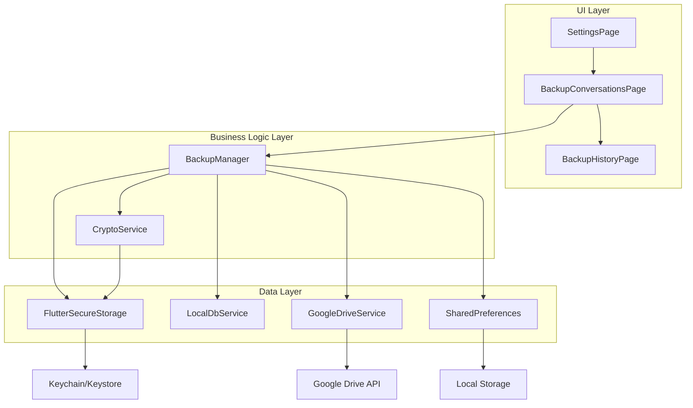

# 技術設計文件：僅備份私鑰 (Key-Only Backup)

## Overview

本設計文件描述「僅備份私鑰 (Key-Only Backup)」功能的技術實作細節。此功能為 chatwmex-app 的端到端加密 (E2EE) 聊天應用程式提供輕量級備份機制，允許使用者選擇僅備份加密後的私鑰至 Google Drive，而不包含對話紀錄與媒體檔案。

### 核心目標

- 提供三種備份模式：完整備份 (full)、僅金鑰備份 (keyOnly)、不備份 (none)
- 使用 AES-GCM 加密私鑰，確保雲端備份安全性
- 支援從雲端還原私鑰，並自動從後端同步加密歷史訊息
- 維持向後相容性，不影響現有完整備份功能

### 技術棧

- **前端**: Flutter 3.x
- **加密**: cryptography package (AES-GCM, X25519, PBKDF2)
- **雲端儲存**: Google Drive API v3
- **本地儲存**: flutter_secure_storage (私鑰), shared_preferences (設定)
- **狀態管理**: Riverpod

## Architecture

### 系統架構圖



### 架構層級說明

#### UI Layer (使用者介面層)
- **SettingsPage**: 全域設定頁面，提供備份模式選擇入口
- **BackupConversationsPage**: 備份管理主頁面，顯示備份狀態與執行備份操作
- **BackupHistoryPage**: 備份歷史記錄頁面，支援還原與刪除操作

#### Business Logic Layer (業務邏輯層)
- **BackupManager**: 統籌備份與還原流程，管理備份狀態
- **CryptoService**: 處理所有加密相關操作，包含私鑰加密/解密

#### Data Layer (資料層)
- **GoogleDriveService**: 封裝 Google Drive API 操作
- **LocalDbService**: 管理本地 SQLite 資料庫
- **FlutterSecureStorage**: 安全儲存私鑰
- **SharedPreferences**: 持久化使用者設定

### 備份模式架構

系統支援三種備份模式，每種模式有不同的資料範圍與還原行為：

| 備份模式 | 備份內容 | 檔案大小 | 還原行為 |
|---------|---------|---------|---------|
| **full** | 私鑰 + 對話紀錄 + 媒體檔案 | 大 (數 MB ~ GB) | 完整還原所有本地資料 |
| **keyOnly** | 僅加密私鑰 | 極小 (~1 KB) | 還原私鑰後從後端同步訊息 |
| **none** | 不備份 | N/A | 無法還原 |

## Components and Interfaces

### 1. BackupMode 列舉

新增備份模式列舉類型，定義於 `app/lib/models/backup_mode.dart`：

```dart
enum BackupMode {
  full,     // 完整備份（對話紀錄 + 媒體 + 私鑰）
  keyOnly,  // 僅備份私鑰
  none;     // 不備份

  String get displayName {
    switch (this) {
      case BackupMode.full:
        return '完整備份';
      case BackupMode.keyOnly:
        return '僅備份金鑰';
      case BackupMode.none:
        return '不備份';
    }
  }

  String get description {
    switch (this) {
      case BackupMode.full:
        return '備份所有對話紀錄、媒體檔案與加密金鑰。還原時可完整恢復所有資料。';
      case BackupMode.keyOnly:
        return '僅備份您的加密身分金鑰。速度最快，不佔空間。對話紀錄將在您換機登入時從伺服器同步並解密。';
      case BackupMode.none:
        return '不進行任何備份。換機時將無法還原歷史資料。';
    }
  }
}
```

### 2. BackupManager 擴充

擴充現有的 `BackupManager` 類別，新增以下方法與屬性：

#### 新增屬性

```dart
class BackupState {
  // ... 現有屬性 ...
  final BackupMode backupMode;  // 新增：備份模式

  BackupState({
    // ... 現有參數 ...
    this.backupMode = BackupMode.full,  // 預設為完整備份
  });
}
```

#### 新增方法

```dart
class BackupManager extends StateNotifier<BackupState> {
  // ... 現有程式碼 ...

  /// 設定備份模式
  Future<void> setBackupMode(BackupMode mode) async {
    final prefs = await SharedPreferences.getInstance();
    await prefs.setString('backupMode', mode.name);
    state = state.copyWith(backupMode: mode);
  }

  /// 執行僅金鑰備份
  Future<void> backupKeyOnly({required String backupPassword}) async {
    state = state.copyWith(isBackingUp: true, clearError: true);

    try {
      // 1. 取得原始私鑰
      final rawPrivateKey = await _cryptoService.getRawPrivateKey();
      if (rawPrivateKey == null) {
        throw Exception('無法取得私鑰');
      }

      // 2. 使用密碼加密私鑰
      final encryptedData = await _cryptoService.encryptPrivateKeyForBackup(
        rawPrivateKey,
        backupPassword,
      );

      // 3. 建立金鑰備份檔案
      final keyBackupFile = {
        'version': '1.0',
        'encryptedKey': encryptedData['encryptedKeyBase64'],
        'salt': encryptedData['saltBase64'],
        'iv': '', // AES-GCM 的 nonce 已包含在 encryptedKey 中
        'algorithm': 'AES-GCM-256',
        'timestamp': DateTime.now().toIso8601String(),
      };

      // 4. 上傳至 Google Drive
      final jsonString = jsonEncode(keyBackupFile);
      final fileName = 'chatwmex_key_backup.json';
      
      final success = await _googleDriveService.uploadBackup(
        jsonString,
        fileName,
      );

      if (success) {
        final prefs = await SharedPreferences.getInstance();
        final nowStr = DateTime.now().toIso8601String();
        await prefs.setString('lastBackupDate', nowStr);
        state = state.copyWith(isBackingUp: false, lastBackupDate: nowStr);
      } else {
        throw Exception('上傳至 Google Drive 失敗');
      }
    } catch (e) {
      state = state.copyWith(
        isBackingUp: false,
        error: '僅金鑰備份失敗：$e',
        clearError: false,
      );
    }
  }

  /// 還原僅金鑰備份
  Future<bool> restoreKeyOnly({
    required String fileId,
    required String backupPassword,
  }) async {
    state = state.copyWith(isBackingUp: true, clearError: true);

    try {
      // 1. 從 Google Drive 下載金鑰備份檔案
      final jsonString = await _googleDriveService.downloadBackup(fileId);
      if (jsonString == null || jsonString.isEmpty) {
        throw Exception('下載備份檔失敗');
      }

      // 2. 解析 JSON
      final keyBackupFile = jsonDecode(jsonString) as Map<String, dynamic>;
      
      // 3. 驗證版本
      final version = keyBackupFile['version'] as String?;
      if (version != '1.0') {
        throw Exception('備份檔案版本不相容');
      }

      // 4. 解密私鑰
      final encryptedKey = keyBackupFile['encryptedKey'] as String;
      final salt = keyBackupFile['salt'] as String;
      
      final rawPrivateKey = await _cryptoService.decryptPrivateKeyFromBackup(
        encryptedKey,
        salt,
        backupPassword,
      );

      // 5. 還原私鑰至本地安全儲存
      await _cryptoService.restorePrivateKey(rawPrivateKey);

      state = state.copyWith(isBackingUp: false);
      return true;
    } catch (e) {
      state = state.copyWith(
        isBackingUp: false,
        error: '還原金鑰失敗：$e',
        clearError: false,
      );
      return false;
    }
  }

  /// 根據備份模式執行對應的備份操作
  Future<void> backupNow({String? backupPassword}) async {
    switch (state.backupMode) {
      case BackupMode.full:
        // 使用現有的完整備份邏輯
        await super.backupNow(backupPassword: backupPassword);
        break;
      case BackupMode.keyOnly:
        if (backupPassword == null || backupPassword.isEmpty) {
          state = state.copyWith(
            error: '僅金鑰備份需要設定密碼',
            clearError: false,
          );
          return;
        }
        await backupKeyOnly(backupPassword: backupPassword);
        break;
      case BackupMode.none:
        // 不執行任何備份
        break;
    }
  }
}
```

### 3. CryptoService 擴充

現有的 `CryptoService` 已包含所需的加密/解密方法，無需修改：

- `encryptPrivateKeyForBackup()`: 使用 PBKDF2 + AES-GCM 加密私鑰
- `decryptPrivateKeyFromBackup()`: 解密私鑰
- `getRawPrivateKey()`: 取得原始私鑰
- `restorePrivateKey()`: 還原私鑰至本地儲存

### 4. GoogleDriveService 擴充

現有的 `GoogleDriveService` 已支援檔案上傳/下載，但需要新增方法以區分金鑰備份檔案：

```dart
class GoogleDriveService {
  // ... 現有程式碼 ...

  /// 列出所有備份檔案（包含完整備份與金鑰備份）
  Future<List<BackupFileInfo>> listAllBackups() async {
    final driveApi = await getDriveApi();
    if (driveApi == null) throw GoogleDriveException.notAuthenticated();

    final folderId = await _getAppFolderId(driveApi);
    if (folderId == null) throw GoogleDriveException.folderCreationFailed();

    try {
      final fileList = await driveApi.files.list(
        q: "'$folderId' in parents and mimeType='application/json' and trashed=false",
        orderBy: 'createdTime desc',
        spaces: 'drive',
        $fields: 'files(id, name, createdTime, size)',
      );

      return (fileList.files ?? []).map((file) {
        final isKeyOnly = file.name?.contains('key_backup') ?? false;
        return BackupFileInfo(
          id: file.id!,
          name: file.name!,
          createdTime: file.createdTime,
          size: file.size,
          type: isKeyOnly ? BackupType.keyOnly : BackupType.full,
        );
      }).toList();
    } catch (e) {
      throw GoogleDriveException.downloadFailed(e.toString());
    }
  }
}

enum BackupType {
  full,
  keyOnly,
}

class BackupFileInfo {
  final String id;
  final String name;
  final DateTime? createdTime;
  final String? size;
  final BackupType type;

  BackupFileInfo({
    required this.id,
    required this.name,
    this.createdTime,
    this.size,
    required this.type,
  });
}
```

### 5. UI 元件修改

#### SettingsPage 新增備份模式選擇

在 `app/lib/features/profile/ui/settings_page.dart` 中新增備份模式選擇區塊：

```dart
// 在備份設定區塊中新增
ListTile(
  title: const Text('備份模式'),
  subtitle: Text(backupMode.displayName),
  trailing: const Icon(Icons.chevron_right),
  onTap: () => _showBackupModeDialog(context),
)
```

#### BackupConversationsPage 修改

修改 `_handleBackupNow()` 方法，根據備份模式決定是否需要密碼：

```dart
Future<void> _handleBackupNow() async {
  final backupMode = ref.read(backupManagerProvider).backupMode;
  
  String? password;
  if (backupMode == BackupMode.keyOnly) {
    // 僅金鑰備份必須設定密碼
    password = await _showPasswordDialog(required: true);
    if (password == null) return; // 使用者取消
  } else if (backupMode == BackupMode.full) {
    // 完整備份可選擇是否加密私鑰
    password = await _showPasswordDialog(required: false);
  }

  ref.read(backupManagerProvider.notifier).backupNow(
    backupPassword: password,
  );
}
```

#### BackupHistoryPage 修改

修改還原邏輯，根據備份檔案類型決定還原流程：

```dart
Future<void> _handleRestore(BackupFileInfo backup) async {
  if (backup.type == BackupType.keyOnly) {
    // 僅金鑰還原：需要輸入密碼
    final password = await _showPasswordInputDialog();
    if (password == null) return;

    final success = await ref
        .read(backupManagerProvider.notifier)
        .restoreKeyOnly(fileId: backup.id, backupPassword: password);

    if (success && mounted) {
      ScaffoldMessenger.of(context).showSnackBar(
        const SnackBar(
          content: Text('私鑰還原成功！正在從伺服器同步訊息...'),
          backgroundColor: Colors.green,
        ),
      );
      // TODO: 觸發從後端同步加密歷史訊息
    }
  } else {
    // 完整備份還原：使用現有邏輯
    final result = await ref
        .read(backupManagerProvider.notifier)
        .restoreBackup(backup.id);
    // ... 現有處理邏輯 ...
  }
}
```

## Data Models

### BackupMode 資料模型

```dart
// app/lib/models/backup_mode.dart
enum BackupMode {
  full,
  keyOnly,
  none;

  String get displayName {
    switch (this) {
      case BackupMode.full:
        return '完整備份';
      case BackupMode.keyOnly:
        return '僅備份金鑰';
      case BackupMode.none:
        return '不備份';
    }
  }

  String get description {
    switch (this) {
      case BackupMode.full:
        return '備份所有對話紀錄、媒體檔案與加密金鑰。還原時可完整恢復所有資料。';
      case BackupMode.keyOnly:
        return '僅備份您的加密身分金鑰。速度最快，不佔空間。對話紀錄將在您換機登入時從伺服器同步並解密。';
      case BackupMode.none:
        return '不進行任何備份。換機時將無法還原歷史資料。';
    }
  }

  static BackupMode fromString(String value) {
    return BackupMode.values.firstWhere(
      (mode) => mode.name == value,
      orElse: () => BackupMode.full,
    );
  }
}
```

### KeyBackupFile 資料模型

金鑰備份檔案的 JSON 結構：

```dart
// app/lib/models/key_backup_file.dart
class KeyBackupFile {
  final String version;
  final String encryptedKey;
  final String salt;
  final String iv;
  final String algorithm;
  final DateTime timestamp;

  const KeyBackupFile({
    required this.version,
    required this.encryptedKey,
    required this.salt,
    required this.iv,
    required this.algorithm,
    required this.timestamp,
  });

  factory KeyBackupFile.fromJson(Map<String, dynamic> json) {
    return KeyBackupFile(
      version: json['version'] as String,
      encryptedKey: json['encryptedKey'] as String,
      salt: json['salt'] as String,
      iv: json['iv'] as String? ?? '',
      algorithm: json['algorithm'] as String,
      timestamp: DateTime.parse(json['timestamp'] as String),
    );
  }

  Map<String, dynamic> toJson() {
    return {
      'version': version,
      'encryptedKey': encryptedKey,
      'salt': salt,
      'iv': iv,
      'algorithm': algorithm,
      'timestamp': timestamp.toIso8601String(),
    };
  }

  /// 驗證檔案格式是否有效
  bool isValid() {
    return version.isNotEmpty &&
           encryptedKey.isNotEmpty &&
           salt.isNotEmpty &&
           algorithm == 'AES-GCM-256';
  }
}
```

### BackupFileInfo 資料模型

```dart
// app/lib/models/backup_file_info.dart
enum BackupType {
  full,
  keyOnly,
}

class BackupFileInfo {
  final String id;
  final String name;
  final DateTime? createdTime;
  final String? size;
  final BackupType type;

  BackupFileInfo({
    required this.id,
    required this.name,
    this.createdTime,
    this.size,
    required this.type,
  });

  String get displayName {
    switch (type) {
      case BackupType.full:
        return '完整備份';
      case BackupType.keyOnly:
        return '金鑰備份';
    }
  }

  String get displaySize {
    if (size == null) return '未知';
    final bytes = int.tryParse(size!) ?? 0;
    if (bytes < 1024) return '$bytes B';
    if (bytes < 1024 * 1024) return '${(bytes / 1024).toStringAsFixed(1)} KB';
    return '${(bytes / (1024 * 1024)).toStringAsFixed(1)} MB';
  }
}
```

### BackupState 擴充

```dart
// 在 app/lib/core/backup/backup_manager.dart 中擴充
class BackupState {
  final bool isBackingUp;
  final String? lastBackupDate;
  final bool autoBackupEnabled;
  final String? autoBackupTime;
  final String? error;
  final String? linkedGoogleEmail;
  final BackupMode backupMode;  // 新增

  BackupState({
    this.isBackingUp = false,
    this.lastBackupDate,
    this.autoBackupEnabled = false,
    this.autoBackupTime,
    this.error,
    this.linkedGoogleEmail,
    this.backupMode = BackupMode.full,  // 新增，預設為完整備份
  });

  BackupState copyWith({
    bool? isBackingUp,
    String? lastBackupDate,
    bool? autoBackupEnabled,
    String? autoBackupTime,
    String? error,
    bool clearError = false,
    String? linkedGoogleEmail,
    BackupMode? backupMode,  // 新增
  }) {
    return BackupState(
      isBackingUp: isBackingUp ?? this.isBackingUp,
      lastBackupDate: lastBackupDate ?? this.lastBackupDate,
      autoBackupEnabled: autoBackupEnabled ?? this.autoBackupEnabled,
      autoBackupTime: autoBackupTime ?? this.autoBackupTime,
      error: clearError ? null : (error ?? this.error),
      linkedGoogleEmail: linkedGoogleEmail ?? this.linkedGoogleEmail,
      backupMode: backupMode ?? this.backupMode,  // 新增
    );
  }
}
```

## Correctness Properties

*A property is a characteristic or behavior that should hold true across all valid executions of a system-essentially, a formal statement about what the system should do. Properties serve as the bridge between human-readable specifications and machine-verifiable correctness guarantees.*

### Property 1: Backup Mode Persistence Round-Trip

*For any* backup mode (full, keyOnly, or none), when the mode is set and the application is restarted, the loaded mode should be identical to the originally set mode.

**Validates: Requirements 1.1, 1.5, 8.2, 8.3**

### Property 2: Private Key Encryption Round-Trip

*For any* private key and recovery password, encrypting the private key with the password and then decrypting it with the same password should yield the original private key.

**Validates: Requirements 2.2, 5.4**

### Property 3: Encryption Randomness

*For any* private key and recovery password, encrypting the same private key multiple times should produce different salt and IV values each time.

**Validates: Requirements 2.3**

### Property 4: Encrypted Key Format Validity

*For any* private key and recovery password, the encrypted output should be valid JSON containing all required fields: version, encryptedKey, salt, iv, algorithm, and timestamp.

**Validates: Requirements 2.4, 9.1, 9.2**

### Property 5: No Plaintext Leakage

*For any* private key and recovery password, the encrypted output should not contain the original private key in plaintext or base64-encoded form.

**Validates: Requirements 2.5**

### Property 6: Backup Failure Error Reporting

*For any* backup operation (full or keyOnly) that fails, the system should display a non-empty error message describing the failure.

**Validates: Requirements 3.6, 4.5**

### Property 7: Restore Failure Data Integrity

*For any* restore operation that fails, the system should preserve all existing local data unchanged.

**Validates: Requirements 6.4**

## Error Handling

### 錯誤分類與處理策略

系統將錯誤分為以下類別，每種類別有對應的處理策略：

#### 1. 網路錯誤

**錯誤情境**:
- 無網路連線
- Google Drive API 請求逾時
- 網路不穩定導致上傳/下載中斷

**處理策略**:
- 顯示使用者友善的錯誤訊息：「網路連線失敗，請檢查您的網路設定」
- 提供重試按鈕
- 不修改本地資料狀態
- 記錄錯誤日誌供除錯使用

**實作範例**:
```dart
try {
  await _googleDriveService.uploadBackup(jsonString, fileName);
} on SocketException {
  state = state.copyWith(
    error: '網路連線失敗，請檢查您的網路設定',
    clearError: false,
  );
} on TimeoutException {
  state = state.copyWith(
    error: '網路連線逾時，請稍後再試',
    clearError: false,
  );
}
```

#### 2. 認證錯誤

**錯誤情境**:
- Google 帳號未登入
- Google Drive 授權過期
- 使用者拒絕授權

**處理策略**:
- 顯示錯誤訊息：「請先連接 Google Drive」
- 引導使用者重新登入
- 清除過期的認證狀態

**實作範例**:
```dart
if (await _googleDriveService.getDriveApi() == null) {
  throw GoogleDriveException.notAuthenticated();
}
```

#### 3. 儲存空間錯誤

**錯誤情境**:
- Google Drive 空間不足
- 本地儲存空間不足

**處理策略**:
- 顯示錯誤訊息：「雲端儲存空間不足，請清理空間後重試」
- 提供清理建議（刪除舊備份）
- 不執行部分備份，保持原子性

#### 4. 加密/解密錯誤

**錯誤情境**:
- 恢復密碼錯誤
- 私鑰資料損壞
- 加密演算法不支援

**處理策略**:
- 顯示具體錯誤訊息：「恢復密碼錯誤，請重新輸入」
- 允許使用者重試（最多 3 次）
- 提供「忘記密碼」引導（無法恢復，需重新備份）

**實作範例**:
```dart
try {
  final rawPrivateKey = await _cryptoService.decryptPrivateKeyFromBackup(
    encryptedKey,
    salt,
    backupPassword,
  );
} catch (e) {
  if (e.toString().contains('Passphrase incorrect')) {
    state = state.copyWith(
      error: '恢復密碼錯誤，請重新輸入',
      clearError: false,
    );
  } else {
    state = state.copyWith(
      error: '解密失敗：資料可能已損壞',
      clearError: false,
    );
  }
}
```

#### 5. 資料完整性錯誤

**錯誤情境**:
- 備份檔案損壞
- JSON 格式錯誤
- 版本不相容

**處理策略**:
- 顯示錯誤訊息：「備份檔案損壞，無法還原」
- 建議使用者嘗試其他備份檔案
- 不修改本地資料

**實作範例**:
```dart
try {
  final keyBackupFile = KeyBackupFile.fromJson(jsonDecode(jsonString));
  if (!keyBackupFile.isValid()) {
    throw Exception('備份檔案格式無效');
  }
  if (keyBackupFile.version != '1.0') {
    throw Exception('備份檔案版本不相容');
  }
} on FormatException {
  state = state.copyWith(
    error: '備份檔案損壞，無法還原',
    clearError: false,
  );
}
```

### 錯誤訊息顯示規範

所有錯誤訊息應遵循以下規範：

1. **使用 SnackBar 顯示暫時性錯誤**（3-5 秒自動消失）
   - 網路錯誤
   - 操作成功訊息

2. **使用 Dialog 顯示需要使用者確認的錯誤**
   - 資料完整性錯誤
   - 版本不相容錯誤
   - 需要使用者決策的錯誤

3. **錯誤訊息應包含**:
   - 問題描述（發生了什麼）
   - 可能原因（為什麼發生）
   - 建議操作（如何解決）

4. **錯誤訊息範例**:
   - ❌ 「錯誤」（太模糊）
   - ✅ 「網路連線失敗，請檢查您的網路設定」（清楚具體）

### 錯誤恢復機制

#### 自動重試機制

對於暫時性錯誤（如網路波動），系統應提供自動重試：

```dart
Future<bool> _uploadWithRetry(String jsonString, String fileName, {int maxRetries = 3}) async {
  for (int attempt = 0; attempt < maxRetries; attempt++) {
    try {
      return await _googleDriveService.uploadBackup(jsonString, fileName);
    } catch (e) {
      if (attempt == maxRetries - 1) rethrow;
      await Future.delayed(Duration(seconds: 2 * (attempt + 1)));
    }
  }
  return false;
}
```

#### 資料回滾機制

還原操作失敗時，應確保本地資料不被破壞：

```dart
Future<bool> restoreKeyOnly({required String fileId, required String backupPassword}) async {
  // 備份當前私鑰（如果存在）
  final currentKey = await _cryptoService.getRawPrivateKey();
  
  try {
    // 執行還原操作
    final rawPrivateKey = await _decryptAndValidate(fileId, backupPassword);
    await _cryptoService.restorePrivateKey(rawPrivateKey);
    return true;
  } catch (e) {
    // 還原失敗，回滾至原始狀態
    if (currentKey != null) {
      await _cryptoService.restorePrivateKey(currentKey);
    }
    rethrow;
  }
}
```

## Testing Strategy

### 測試方法論

本功能採用雙重測試策略，結合單元測試與屬性測試，確保全面的程式碼覆蓋與正確性驗證。

#### 單元測試 (Unit Tests)

單元測試專注於具體範例、邊界條件與元件整合：

**測試範圍**:
- 具體的使用者操作流程（如選擇 keyOnly 模式並執行備份）
- UI 元件渲染（如備份模式選擇介面是否正確顯示）
- 錯誤情境處理（如密碼錯誤、網路失敗）
- 元件間互動（如 BackupManager 呼叫 CryptoService）

**測試框架**: Flutter Test

**範例測試**:
```dart
// test/core/backup/backup_manager_test.dart
void main() {
  group('BackupManager - Key-Only Backup', () {
    test('should set backup mode to keyOnly', () async {
      final manager = BackupManager(mockDrive, mockDb, mockCrypto, mockStorage);
      await manager.setBackupMode(BackupMode.keyOnly);
      expect(manager.state.backupMode, BackupMode.keyOnly);
    });

    test('should throw error when keyOnly backup without password', () async {
      final manager = BackupManager(mockDrive, mockDb, mockCrypto, mockStorage);
      await manager.setBackupMode(BackupMode.keyOnly);
      await manager.backupNow(backupPassword: null);
      expect(manager.state.error, contains('需要設定密碼'));
    });

    test('should display network error message on upload failure', () async {
      when(mockDrive.uploadBackup(any, any)).thenThrow(SocketException(''));
      final manager = BackupManager(mockDrive, mockDb, mockCrypto, mockStorage);
      await manager.backupKeyOnly(backupPassword: 'test123');
      expect(manager.state.error, contains('網路連線失敗'));
    });
  });
}
```

#### 屬性測試 (Property-Based Tests)

屬性測試驗證系統在大量隨機輸入下的通用正確性：

**測試框架**: [test_api](https://pub.dev/packages/test_api) with custom property test helpers

**測試配置**:
- 每個屬性測試最少執行 100 次迭代
- 使用隨機生成器產生測試資料
- 每個測試標註對應的設計文件屬性編號

**範例測試**:
```dart
// test/core/crypto/crypto_service_property_test.dart
void main() {
  group('CryptoService - Property Tests', () {
    // Feature: key-only-backup, Property 2: Private Key Encryption Round-Trip
    test('Property 2: encryption then decryption should yield original key', () async {
      final crypto = CryptoService();
      final random = Random();
      
      for (int i = 0; i < 100; i++) {
        // Generate random private key and password
        final privateKey = base64Encode(
          List.generate(32, (_) => random.nextInt(256)),
        );
        final password = 'password_${random.nextInt(10000)}';
        
        // Encrypt then decrypt
        final encrypted = await crypto.encryptPrivateKeyForBackup(
          privateKey,
          password,
        );
        final decrypted = await crypto.decryptPrivateKeyFromBackup(
          encrypted['encryptedKeyBase64']!,
          encrypted['saltBase64']!,
          password,
        );
        
        // Verify round-trip
        expect(decrypted, equals(privateKey));
      }
    });

    // Feature: key-only-backup, Property 3: Encryption Randomness
    test('Property 3: multiple encryptions should produce different salt/IV', () async {
      final crypto = CryptoService();
      final privateKey = base64Encode(List.generate(32, (_) => 42));
      final password = 'test_password';
      
      final salts = <String>{};
      final encryptedKeys = <String>{};
      
      for (int i = 0; i < 100; i++) {
        final encrypted = await crypto.encryptPrivateKeyForBackup(
          privateKey,
          password,
        );
        salts.add(encrypted['saltBase64']!);
        encryptedKeys.add(encrypted['encryptedKeyBase64']!);
      }
      
      // All salts and encrypted outputs should be unique
      expect(salts.length, equals(100));
      expect(encryptedKeys.length, equals(100));
    });

    // Feature: key-only-backup, Property 5: No Plaintext Leakage
    test('Property 5: encrypted output should not contain plaintext key', () async {
      final crypto = CryptoService();
      final random = Random();
      
      for (int i = 0; i < 100; i++) {
        final privateKey = base64Encode(
          List.generate(32, (_) => random.nextInt(256)),
        );
        final password = 'password_${random.nextInt(10000)}';
        
        final encrypted = await crypto.encryptPrivateKeyForBackup(
          privateKey,
          password,
        );
        
        final encryptedJson = jsonEncode(encrypted);
        
        // Verify plaintext key is not in the output
        expect(encryptedJson.contains(privateKey), isFalse);
      }
    });
  });
}
```

### Widget 測試

測試 UI 元件的渲染與互動：

```dart
// test/features/chat/ui/backup_conversations_page_test.dart
void main() {
  testWidgets('should display backup mode selection', (tester) async {
    await tester.pumpWidget(
      ProviderScope(
        child: MaterialApp(home: BackupConversationsPage()),
      ),
    );
    
    expect(find.text('備份模式'), findsOneWidget);
    expect(find.text('完整備份'), findsOneWidget);
    expect(find.text('僅備份金鑰'), findsOneWidget);
    expect(find.text('不備份'), findsOneWidget);
  });

  testWidgets('should show password dialog for keyOnly backup', (tester) async {
    // ... test implementation
  });
}
```

### 整合測試

測試完整的備份與還原流程：

```dart
// integration_test/backup_restore_flow_test.dart
void main() {
  testWidgets('complete key-only backup and restore flow', (tester) async {
    // 1. Set backup mode to keyOnly
    // 2. Execute backup with password
    // 3. Verify backup file uploaded to Drive
    // 4. Clear local key
    // 5. Restore from backup
    // 6. Verify key restored correctly
    // 7. Verify can decrypt old messages
  });
}
```

### 測試覆蓋率目標

- **單元測試覆蓋率**: ≥ 80%
- **關鍵路徑覆蓋率**: 100%（加密/解密、備份/還原）
- **錯誤處理覆蓋率**: ≥ 90%

### 持續整合

所有測試應在 CI/CD 流程中自動執行：

```yaml
# .github/workflows/test.yml
name: Test
on: [push, pull_request]
jobs:
  test:
    runs-on: ubuntu-latest
    steps:
      - uses: actions/checkout@v2
      - uses: subosito/flutter-action@v2
      - run: flutter pub get
      - run: flutter analyze
      - run: flutter test --coverage
      - run: flutter test integration_test/
```

