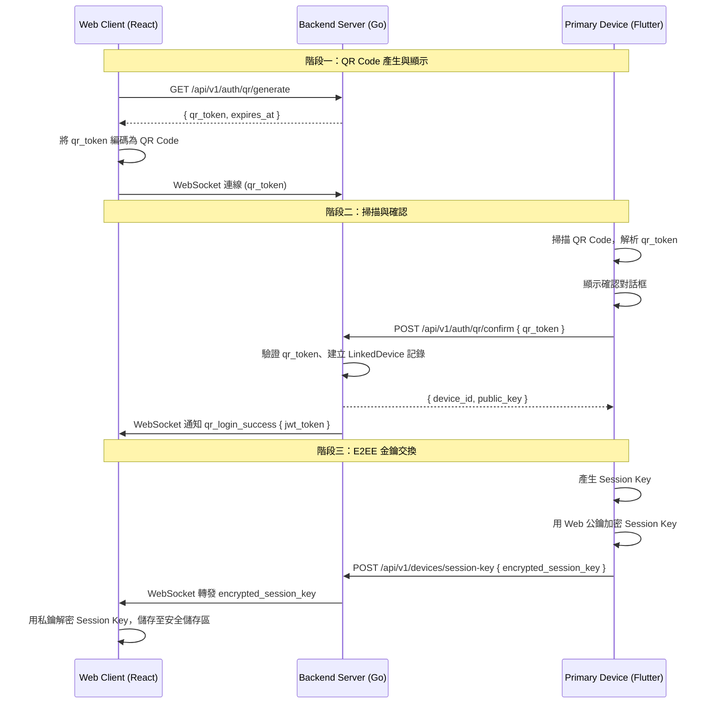
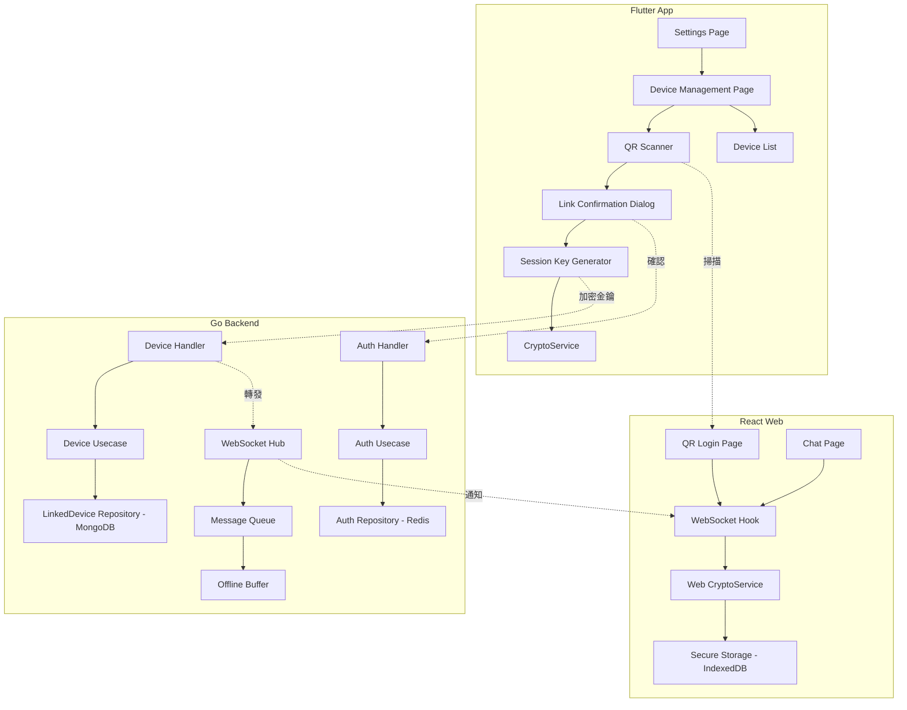

# 設計文件：已連結裝置 (Linked Devices)

## 概述

本設計為 ChatWMEX 聊天應用實現「已連結裝置」功能，允許使用者透過手機掃描網頁版 QR Code 來連結網頁端裝置，實現跨裝置即時訊息同步。

系統涉及三個主要元件：
- **Flutter 手機端 (Primary Device)**：掃描 QR Code、確認連結、產生並分發 Session Key
- **Go 後端 (Backend Server)**：管理 QR Token 生命週期、裝置註冊、訊息轉發、離線訊息暫存
- **React 網頁端 (Web Client / Linked Device)**：顯示 QR Code、接收 Session Key、解密並顯示訊息

核心設計原則：
1. 主裝置為唯一信任根源，所有連結授權必須由主裝置發起
2. 後端僅轉發加密資料，不得接觸明文金鑰
3. 連結裝置數量上限 4 台，30 天未活躍自動取消連結
4. QR Token 一次性使用，3 分鐘過期，防止重放攻擊

## 架構

### 系統架構圖



### 元件架構圖



## 元件與介面

### 1. 後端 API 端點

#### 1.1 QR Token 管理（擴展現有 Auth Handler）

| 端點 | 方法 | 說明 | 認證 |
|------|------|------|------|
| `/api/v1/auth/qr/generate` | GET | 產生 QR Token（已存在） | 無 |
| `/api/v1/auth/qr/confirm` | POST | 確認 QR Token 並建立連結（擴展） | JWT |

擴展 `ConfirmQRToken`：除了現有的 JWT 產生邏輯，新增：
- 建立 `LinkedDevice` 記錄
- 檢查已連結裝置數量上限（4 台）
- 回傳 `device_id` 與 Web Client 的公鑰給 Primary Device
- 記錄連結失敗次數（速率限制）

#### 1.2 裝置管理 API（新增）

| 端點 | 方法 | 說明 | 認證 |
|------|------|------|------|
| `/api/v1/devices/linked` | GET | 取得已連結裝置清單 | JWT |
| `/api/v1/devices/linked/:id` | DELETE | 取消連結指定裝置 | JWT |
| `/api/v1/devices/session-key` | POST | 傳送加密的 Session Key | JWT |

#### 1.3 WebSocket 事件（擴展現有 Hub）

| 事件名稱 | 方向 | 說明 |
|----------|------|------|
| `qr_login_success` | Server → Web | 連結成功，攜帶 JWT Token（已存在） |
| `session_key_delivery` | Server → Web | 轉發加密的 Session Key |
| `device_unlinked` | Server → Web | 通知裝置已被取消連結 |
| `read_status_sync` | Server → All Devices | 同步已讀狀態 |

### 2. Flutter 元件

#### 2.1 Settings Page 擴展
- 在「一般設定」區塊中，「分類名單」之後新增「已連結裝置」入口
- 顯示已連結裝置數量徽章

#### 2.2 Device Management Page（新增）
- 路由：`/settings/linked-devices`
- 使用 Riverpod `StateNotifierProvider` 管理裝置清單狀態
- 支援下拉刷新、左滑/長按取消連結

#### 2.3 QR Scanner Integration
- 使用 `mobile_scanner` 套件掃描 QR Code
- 解析 QR Token 後顯示確認對話框

#### 2.4 Session Key Distribution Service
- 擴展現有 `CryptoService`，新增 `generateSessionKey()` 與 `encryptSessionKeyForDevice()` 方法

### 3. React Web 元件

#### 3.1 QR Login Page 擴展
- 新增 QR Token 過期倒數計時器
- 剩餘不足 30 秒時自動重新產生
- 新增「QR Code 已過期」提示與重新產生按鈕

#### 3.2 Web CryptoService（新增）
- 使用 Web Crypto API (SubtleCrypto) 實現 X25519 金鑰交換
- 使用 IndexedDB 安全儲存 Session Key
- 提供 `decryptMessage()` 方法供聊天頁面使用

### 4. 訊息同步機制

#### 4.1 即時同步
- 擴展現有 WebSocket Hub 的 `routeMessage` 方法
- 當使用者發送訊息時，同時轉發加密副本給所有已連結裝置
- 已讀狀態透過 `read_status_sync` 事件同步

#### 4.2 離線訊息暫存
- 使用 MongoDB 集合 `offline_messages_linked` 暫存離線裝置的訊息
- 7 天 TTL 自動清理過期訊息
- 裝置重新上線時依時間順序送達


## 資料模型

### 1. LinkedDevice（MongoDB 集合：`linked_devices`）

```go
type LinkedDevice struct {
    ID            string    `json:"id" bson:"_id"`
    UserID        string    `json:"user_id" bson:"user_id"`
    DeviceName    string    `json:"device_name" bson:"device_name"`
    Platform      string    `json:"platform" bson:"platform"`         // "web"
    PublicKey     string    `json:"public_key" bson:"public_key"`     // Web 端的 X25519 公鑰
    LinkedAt      time.Time `json:"linked_at" bson:"linked_at"`
    LastActiveAt  time.Time `json:"last_active_at" bson:"last_active_at"`
    ExpiresAt     time.Time `json:"expires_at" bson:"expires_at"`    // 30 天後自動過期
}
```

索引：
- `user_id`：查詢使用者的所有已連結裝置
- `expires_at`：MongoDB TTL 索引，30 天自動刪除

### 2. QR Token 擴展（Redis）

現有 QR Token 結構擴展，新增欄位：

```
Key: qr_token:{token}
Value: {
    "status": "pending" | "confirmed",
    "user_id": "",           // 確認後填入
    "device_id": "",         // 確認後填入
    "web_public_key": "",    // Web 端產生的公鑰
    "created_at": timestamp,
    "used": false            // 一次性使用標記
}
TTL: 180 秒（3 分鐘）
```

### 3. 連結失敗速率限制（Redis）

```
Key: link_rate_limit:{user_id}
Value: 失敗次數 (int)
TTL: 300 秒（5 分鐘）
```

當失敗次數達到 5 次，設定封鎖：
```
Key: link_blocked:{user_id}
Value: true
TTL: 900 秒（15 分鐘）
```

### 4. 離線訊息暫存（MongoDB 集合：`offline_messages_linked`）

```go
type OfflineLinkedMessage struct {
    ID        string    `json:"id" bson:"_id"`
    DeviceID  string    `json:"device_id" bson:"device_id"`
    Message   *Message  `json:"message" bson:"message"`
    CreatedAt time.Time `json:"created_at" bson:"created_at"`
    ExpiresAt time.Time `json:"expires_at" bson:"expires_at"` // 7 天 TTL
}
```

索引：
- `device_id` + `created_at`：按時間順序查詢裝置的離線訊息
- `expires_at`：MongoDB TTL 索引，7 天自動刪除

### 5. Domain 介面擴展

```go
// LinkedDeviceRepository 已連結裝置資料存取介面
type LinkedDeviceRepository interface {
    Create(ctx context.Context, device *LinkedDevice) error
    Delete(ctx context.Context, deviceID string) error
    DeleteByUserID(ctx context.Context, userID string) error
    GetByID(ctx context.Context, deviceID string) (*LinkedDevice, error)
    GetByUserID(ctx context.Context, userID string) ([]*LinkedDevice, error)
    CountByUserID(ctx context.Context, userID string) (int, error)
    UpdateLastActive(ctx context.Context, deviceID string) error
}

// LinkedDeviceUsecase 已連結裝置業務邏輯介面
type LinkedDeviceUsecase interface {
    LinkDevice(ctx context.Context, userID string, device *LinkedDevice) error
    UnlinkDevice(ctx context.Context, userID, deviceID string) error
    UnlinkAllDevices(ctx context.Context, userID string) error
    GetLinkedDevices(ctx context.Context, userID string) ([]*LinkedDevice, error)
    GetLinkedDeviceCount(ctx context.Context, userID string) (int, error)
    DeliverSessionKey(ctx context.Context, userID, deviceID, encryptedKey string) error
}

// OfflineLinkedMessageRepository 離線訊息暫存介面
type OfflineLinkedMessageRepository interface {
    Store(ctx context.Context, msg *OfflineLinkedMessage) error
    GetByDeviceID(ctx context.Context, deviceID string) ([]*OfflineLinkedMessage, error)
    DeleteByDeviceID(ctx context.Context, deviceID string) error
}
```

### 6. AuthRepository 擴展

```go
type AuthRepository interface {
    // 現有方法...
    SaveQRToken(ctx context.Context, token string, expires time.Duration) error
    ConfirmQRToken(ctx context.Context, token, userID string) error
    GetQRTokenStatus(ctx context.Context, token string) (status QRTokenStatus, userID string, err error)
    
    // 新增方法
    SaveQRTokenWithPublicKey(ctx context.Context, token, webPublicKey string, expires time.Duration) error
    GetQRTokenDetail(ctx context.Context, token string) (*QRTokenDetail, error)
    MarkQRTokenUsed(ctx context.Context, token string) error
    
    // 速率限制
    IncrementLinkFailure(ctx context.Context, userID string) (int, error)
    IsLinkBlocked(ctx context.Context, userID string) (bool, error)
    BlockLinkAttempts(ctx context.Context, userID string) error
}

type QRTokenDetail struct {
    Token        string
    Status       QRTokenStatus
    UserID       string
    DeviceID     string
    WebPublicKey string
    Used         bool
    CreatedAt    time.Time
}
```


## 正確性屬性 (Correctness Properties)

*屬性是一種在系統所有有效執行中都應成立的特徵或行為——本質上是對系統應做什麼的形式化陳述。屬性作為人類可讀規格與機器可驗證正確性保證之間的橋樑。*

### Property 1: 裝置數量上限不變量

*For any* 使用者，其已連結裝置數量在任何操作後都不應超過 4 台。對任意使用者呼叫 `LinkDevice`，若當前已連結裝置數量已達 4 台，操作應被拒絕且裝置數量維持不變。

**Validates: Requirements 2.6**

### Property 2: QR Token 一次性使用

*For any* QR Token，在被成功確認使用一次後，任何後續的確認請求都應回傳錯誤。即 `ConfirmQRToken(token)` 成功後，再次呼叫 `ConfirmQRToken(token)` 必定失敗。

**Validates: Requirements 3.7, 8.1**

### Property 3: 過期 QR Token 拒絕確認

*For any* 已過期的 QR Token，確認請求應回傳錯誤。即 Token 建立超過 3 分鐘後，`ConfirmQRToken(token)` 必定失敗。

**Validates: Requirements 3.6**

### Property 4: Session Key 加密解密往返

*For any* 隨機產生的 Session Key 與 X25519 金鑰對，使用公鑰加密 Session Key 後，再使用對應的私鑰解密，應得到與原始 Session Key 完全相同的值。

**Validates: Requirements 5.2, 5.4**

### Property 5: 訊息扇出至所有使用者裝置

*For any* 使用者的任一裝置（主裝置或已連結裝置）發送的訊息，後端的訊息路由邏輯應將該訊息轉發給該使用者的所有其他裝置。即發送裝置以外的所有裝置都應收到訊息副本。

**Validates: Requirements 6.1, 6.2**

### Property 6: 離線訊息暫存與 7 天 TTL

*For any* 在已連結裝置離線期間產生的訊息，該訊息應被儲存至離線暫存區，且其 `ExpiresAt` 欄位應設定為建立時間加 7 天。

**Validates: Requirements 6.3, 6.5**

### Property 7: 離線訊息依時間順序送達

*For any* 已連結裝置重新上線時，其接收到的離線訊息應按 `CreatedAt` 時間戳嚴格遞增排序。

**Validates: Requirements 6.4**

### Property 8: 取消連結刪除裝置記錄

*For any* 已連結裝置，執行取消連結操作後，該裝置記錄應從資料庫中被刪除，且後續查詢該裝置 ID 應回傳空結果。

**Validates: Requirements 4.3**

### Property 9: 已讀狀態同步至所有裝置

*For any* 使用者在任一裝置上標記訊息為已讀，該已讀狀態應被廣播至該使用者的所有其他已連結裝置。

**Validates: Requirements 6.6**

### Property 10: 連結失敗速率限制

*For any* 使用者在 5 分鐘內連續失敗 5 次連結嘗試後，後續的連結請求應被封鎖 15 分鐘。在封鎖期間，`ConfirmQRToken` 應回傳速率限制錯誤。

**Validates: Requirements 8.2**

### Property 11: 登出級聯取消所有連結

*For any* 使用者在主裝置上登出帳號，該使用者的所有已連結裝置記錄應被刪除。即登出後，`GetLinkedDevices(userID)` 應回傳空清單。

**Validates: Requirements 8.5**

### Property 12: 裝置清單顯示完整資訊

*For any* 已連結裝置清單，每個裝置項目的渲染結果應包含裝置名稱、平台類型和最後活躍時間三個欄位。

**Validates: Requirements 2.1**

### Property 13: 數量徽章條件顯示

*For any* 已連結裝置數量 n，當 n > 0 時設定頁面應顯示數量徽章，當 n = 0 時不應顯示徽章。

**Validates: Requirements 1.3**

### Property 14: 連結成功建立裝置記錄

*For any* 成功的連結流程，後端應建立包含裝置 ID、使用者 ID、平台類型、連結時間、最後活躍時間的完整 `LinkedDevice` 記錄，且 `ExpiresAt` 應設定為連結時間加 30 天。

**Validates: Requirements 4.1, 4.6**

### Property 15: 取消連結後金鑰重新分發

*For any* 取消連結操作，若使用者仍有其餘已連結裝置，主裝置應為每個剩餘裝置產生並分發新的 Session Key。

**Validates: Requirements 5.6**


## 錯誤處理

### 後端錯誤處理

| 錯誤情境 | HTTP 狀態碼 | 錯誤訊息 | 處理方式 |
|----------|------------|---------|---------|
| QR Token 過期 | 400 | `qr_token_expired` | 前端提示重新掃描 |
| QR Token 已使用 | 400 | `qr_token_already_used` | 前端提示此 QR Code 已被使用 |
| QR Token 無效 | 400 | `qr_token_invalid` | 前端提示無效的 QR Code |
| 裝置數量已達上限 | 400 | `max_devices_reached` | 前端提示已達 4 台上限 |
| 連結被速率限制 | 429 | `rate_limited` | 前端提示稍後再試，顯示剩餘封鎖時間 |
| Session Key 傳遞失敗 | 500 | `session_key_delivery_failed` | 前端提示金鑰傳遞失敗，請重新連結 |
| 裝置不存在 | 404 | `device_not_found` | 前端提示裝置不存在 |
| 未授權操作 | 401 | `unauthorized` | 導航至登入頁面 |

### Flutter 端錯誤處理

- QR 掃描失敗：顯示「無法辨識 QR Code，請重試」提示
- 網路連線中斷：顯示重試按鈕，自動重試 3 次
- Session Key 產生失敗：顯示「金鑰產生失敗」提示，中止連結流程
- 相機權限被拒：顯示權限說明並引導至系統設定

### Web 端錯誤處理

- WebSocket 斷線：自動重連（已有 3 秒重連機制）
- JWT Token 過期：導航至 QR 登入頁面
- Session Key 解密失敗：顯示「連結已失效，請重新掃描 QR Code」
- IndexedDB 存取失敗：降級至 sessionStorage，並提示使用者資料不會跨分頁保留

## 測試策略

### 屬性測試 (Property-Based Testing)

使用以下測試框架：
- **Go 後端**：`testing/quick` 標準庫 + `github.com/leanovate/gopter` 進行屬性測試
- **Flutter**：`glados` 套件進行屬性測試
- **React Web**：`fast-check` 進行屬性測試

每個屬性測試配置：
- 最少執行 100 次迭代
- 每個測試以註解標記對應的設計屬性
- 標記格式：**Feature: linked-devices, Property {number}: {property_text}**

每個正確性屬性必須由單一屬性測試實現。

### 單元測試

單元測試聚焦於：
- 特定範例驗證（如：確認特定 QR Token 格式）
- 邊界條件（如：裝置數量為 0、恰好 4 台）
- 錯誤條件（如：無效 Token、過期 Token、速率限制觸發）
- 元件整合點（如：WebSocket 事件觸發正確的處理函式）

### 測試範圍分配

| 測試類型 | 涵蓋範圍 |
|---------|---------|
| 屬性測試 | Property 1-15（裝置上限、Token 一次性使用、加密往返、訊息扇出、離線暫存、排序、速率限制等） |
| 單元測試 | API 端點回應格式、WebSocket 事件格式、UI 元件渲染、導航邏輯、錯誤提示顯示 |
| 整合測試 | 完整連結流程（QR 產生 → 掃描 → 確認 → 金鑰交換 → 訊息同步） |

