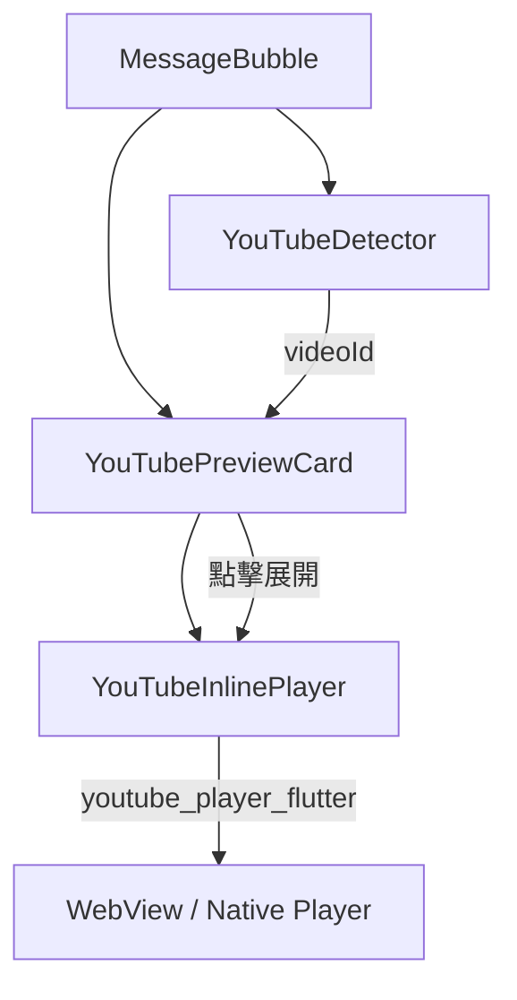
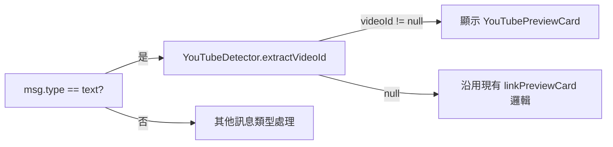

# 技術設計文件：YouTube Inline Player

## 概覽

本功能在現有 Flutter chat app 的 `MessageBubble` 中新增 YouTube 影片連結偵測、縮圖預覽與內嵌播放能力。設計目標是以最小侵入性整合到現有架構，不修改 `Message` 資料模型，僅在 UI 層新增偵測邏輯與 Widget 元件。

### 設計原則

- **零後端依賴**：縮圖直接使用 YouTube 公開圖片 CDN（`img.youtube.com`），不需要呼叫 YouTube Data API
- **最小侵入性**：不修改 `Message`、`LinkPreview` 資料模型，不改動後端 API
- **狀態安全**：在解密失敗、解密重試、已收回等特殊狀態下完全跳過 YouTube 邏輯
- **資源管理**：離開頁面時自動釋放播放器資源，避免記憶體洩漏

---

## 架構

### 元件關係圖



### 整合點

`MessageBubble._buildContent()` 中，在現有 `linkPreviewCard` 邏輯之前插入 YouTube 偵測分支：



### 檔案結構

```
app/lib/features/chat/
├── utils/
│   └── youtube_detector.dart          # 新增：YouTube URL 解析工具
└── ui/
    └── widgets/
        ├── message_bubble.dart        # 修改：整合 YouTube 預覽邏輯
        ├── youtube_preview_card.dart  # 新增：縮圖預覽 Widget
        └── youtube_inline_player.dart # 新增：內嵌播放器 Widget
```

---

## 元件與介面

### YouTubeDetector（`youtube_detector.dart`）

純函式工具類，負責從訊息文字中解析 YouTube Video ID。

```dart
class YouTubeDetector {
  /// 從訊息內容中提取 YouTube Video ID
  /// 支援格式：
  ///   - https://www.youtube.com/watch?v={videoId}
  ///   - https://youtu.be/{videoId}
  ///   - https://youtube.com/watch?v={videoId}
  ///   - https://m.youtube.com/watch?v={videoId}
  ///   - https://www.youtube.com/shorts/{videoId}
  ///
  /// 返回 11 字元的 videoId，或 null（無效/不存在）
  static String? extractVideoId(String content);

  /// 從 videoId 建構縮圖 URL
  static String thumbnailUrl(String videoId);
}
```

**解析邏輯**：使用單一正規表達式匹配所有支援格式，提取 Video ID 後驗證長度為 11 個字元。

```dart
static final _youtubeRegex = RegExp(
  r'(?:youtube\.com/(?:watch\?v=|shorts/)|youtu\.be/)([A-Za-z0-9_-]{11})',
  caseSensitive: false,
);
```

---

### YouTubePreviewCard（`youtube_preview_card.dart`）

顯示影片縮圖與播放按鈕的 StatefulWidget，點擊後切換至 `YouTubeInlinePlayer`。

```dart
class YouTubePreviewCard extends StatefulWidget {
  final String videoId;
  final bool isMe;           // 用於套用對應的 bubble 顏色 token
  final double maxWidth;     // 來自 MediaQuery * 0.65

  const YouTubePreviewCard({
    super.key,
    required this.videoId,
    required this.isMe,
    required this.maxWidth,
  });
}
```

**狀態**：`_isPlayerExpanded`（bool）控制顯示縮圖或播放器。

**縮圖顯示規格**：
- 寬度：`maxWidth`（`MediaQuery.of(context).size.width * 0.65`）
- 高度：`maxWidth * 9 / 16`（16:9 比例）
- 圓角：`BorderRadius.circular(8)`
- 中央疊加：`Icons.play_circle_filled`，大小 48，白色，帶半透明黑色背景圓

---

### YouTubeInlinePlayer（`youtube_inline_player.dart`）

使用 `youtube_player_flutter` 套件的內嵌播放器 Widget。

```dart
class YouTubeInlinePlayer extends StatefulWidget {
  final String videoId;
  final double width;

  const YouTubeInlinePlayer({
    super.key,
    required this.videoId,
    required this.width,
  });
}
```

**生命週期管理**：
- `initState`：建立 `YoutubePlayerController`，設定 `autoPlay: true`
- `dispose`：呼叫 `controller.close()` 釋放資源

**錯誤處理**：監聽 `controller.value.hasError`，若有錯誤則顯示錯誤提示並回退至縮圖狀態（透過 callback 通知父 Widget）。

---

### MessageBubble 修改點

在 `_MessageBubbleState.build()` 中，於現有 `hasPreview` 判斷之前插入 YouTube 偵測邏輯：

```dart
// 新增：YouTube 連結偵測
final youtubeVideoId = (!msg.isUnsent &&
    !isDecryptionFailure &&
    !isDecryptingRetry &&
    msg.type == MessageType.text)
    ? YouTubeDetector.extractVideoId(msg.content)
    : null;

// 修改：hasPreview 判斷排除已有 YouTube 預覽的情況
final hasPreview = youtubeVideoId == null && /* 原有條件 */;
```

在 `Column` 的 children 中，`linkPreviewCard` 替換為：

```dart
if (youtubeVideoId != null)
  YouTubePreviewCard(
    videoId: youtubeVideoId,
    isMe: isMe,
    maxWidth: MediaQuery.of(context).size.width * 0.65,
  )
else if (linkPreviewCard != null)
  linkPreviewCard,
```

---

## 資料模型

本功能**不修改**任何現有資料模型（`Message`、`LinkPreview`）。

### 新增依賴套件

在 `app/pubspec.yaml` 的 `dependencies` 區塊新增：

```yaml
youtube_player_flutter: ^9.1.1
```

> `youtube_player_flutter` 使用 WebView 在 iOS/Android 上渲染 YouTube 播放器，支援全螢幕、播放控制列，無需 YouTube API Key。

### YouTubeDetector 內部資料流

```
訊息文字 (String)
    ↓ extractVideoId()
正規表達式匹配
    ↓ 成功
Video ID (String, 11 chars)
    ↓ thumbnailUrl()
縮圖 URL: https://img.youtube.com/vi/{videoId}/hqdefault.jpg
```

### 播放器狀態（僅存在於 Widget 生命週期）

| 狀態 | 類型 | 說明 |
|------|------|------|
| `_isPlayerExpanded` | `bool` | 是否已展開播放器（在 `YouTubePreviewCard` 中） |
| `_controller` | `YoutubePlayerController?` | 播放器控制器（在 `YouTubeInlinePlayer` 中） |
| `_hasError` | `bool` | 播放器是否發生錯誤 |

所有狀態均為 Widget 本地狀態，不進入 Riverpod 狀態管理，不持久化。


---

## 正確性屬性

*屬性（Property）是在系統所有有效執行中都應成立的特性或行為，本質上是對系統應做什麼的形式化陳述。屬性作為人類可讀規格與機器可驗證正確性保證之間的橋樑。*

### Property 1：YouTube URL Round-Trip 解析

*對任意* 長度為 11 個字元的有效 Video ID（由 `[A-Za-z0-9_-]` 組成），將其組合成任一支援格式的 YouTube URL（`watch?v=`、`youtu.be/`、`shorts/`、`m.youtube.com/watch?v=`），再透過 `YouTubeDetector.extractVideoId()` 解析，應得到與原始 Video ID 完全相同的字串，且長度恆為 11 個字元。

**Validates: Requirements 1.1, 1.2, 5.1, 5.2**

---

### Property 2：非 YouTube 輸入的安全性

*對任意* 字串輸入（包含空字串、純文字、非 YouTube URL、隨機字元），`YouTubeDetector.extractVideoId()` 應返回 `null` 而非拋出任何例外。

**Validates: Requirements 1.3, 5.3, 5.4**

---

### Property 3：無效 YouTube URL 返回 null

*對任意* 格式錯誤的 YouTube URL（如 Video ID 長度不足 11 字元、包含非法字元、缺少必要路徑段），`YouTubeDetector.extractVideoId()` 應返回 `null`。

**Validates: Requirements 1.4**

---

### Property 4：縮圖 URL 格式正確性

*對任意* 有效的 Video ID，`YouTubeDetector.thumbnailUrl(videoId)` 應返回格式為 `https://img.youtube.com/vi/{videoId}/hqdefault.jpg` 的字串，且返回值中包含原始 Video ID。

**Validates: Requirements 2.2**

---

## 錯誤處理

### 縮圖載入失敗

使用 `CachedNetworkImageWidget`（現有元件）的 `errorWidget` 參數，顯示帶有 YouTube 圖示的佔位容器：

```dart
errorWidget: Container(
  color: tokens.composerBackground,
  child: const Icon(Icons.smart_display, color: Colors.red),
),
```

### 播放器初始化失敗

`YouTubeInlinePlayer` 監聽 `YoutubePlayerController` 的錯誤狀態：

```dart
controller.addListener(() {
  if (controller.value.hasError && !_hasError) {
    setState(() => _hasError = true);
    widget.onError?.call(); // 通知父 Widget 回退至縮圖狀態
  }
});
```

父 Widget `YouTubePreviewCard` 收到 `onError` 回調後，將 `_isPlayerExpanded` 設回 `false`，恢復縮圖顯示。

### 網路不可用

`youtube_player_flutter` 套件內建網路錯誤處理，會觸發 `hasError` 狀態，由上述錯誤處理流程統一處理。

### 特殊訊息狀態保護

在 `MessageBubble` 中，以下狀態下完全跳過 YouTube 邏輯（guard clause）：

| 狀態 | 條件 |
|------|------|
| 訊息已收回 | `msg.isUnsent == true` |
| 解密失敗 | `isDecryptionFailure == true` |
| 解密重試中 | `isDecryptingRetry == true` |
| 非文字訊息 | `msg.type != MessageType.text` |

---

## 測試策略

### 雙軌測試方法

本功能採用**單元測試**與**屬性測試**並行的策略：

- **單元測試**：驗證具體範例、邊界條件、UI 互動
- **屬性測試**：驗證對所有輸入都成立的普遍屬性

### 屬性測試（Property-Based Testing）

使用現有的 `glados` 套件（已在 `pubspec.yaml` 的 `dev_dependencies` 中）進行屬性測試。

每個屬性測試最少執行 **100 次迭代**。

**測試標籤格式**：`// Feature: youtube-inline-player, Property {N}: {property_text}`

#### Property 1 測試：YouTube URL Round-Trip

```dart
// Feature: youtube-inline-player, Property 1: YouTube URL round-trip 解析
test('對任意有效 videoId，組合成 URL 後解析應得到相同 videoId', () {
  Glados<String>(any.validYoutubeVideoId).test((videoId) {
    final formats = [
      'https://www.youtube.com/watch?v=$videoId',
      'https://youtu.be/$videoId',
      'https://youtube.com/watch?v=$videoId',
      'https://m.youtube.com/watch?v=$videoId',
      'https://www.youtube.com/shorts/$videoId',
    ];
    for (final url in formats) {
      expect(YouTubeDetector.extractVideoId(url), equals(videoId));
    }
  });
});
```

#### Property 2 測試：非 YouTube 輸入安全性

```dart
// Feature: youtube-inline-player, Property 2: 非 YouTube 輸入安全性
test('對任意字串輸入，extractVideoId 不應拋出例外', () {
  Glados<String>(any.string).test((input) {
    expect(() => YouTubeDetector.extractVideoId(input), returnsNormally);
  });
});
```

#### Property 3 測試：無效 YouTube URL 返回 null

```dart
// Feature: youtube-inline-player, Property 3: 無效 YouTube URL 返回 null
test('對格式錯誤的 YouTube URL，extractVideoId 應返回 null', () {
  Glados<String>(any.invalidYoutubeUrl).test((url) {
    expect(YouTubeDetector.extractVideoId(url), isNull);
  });
});
```

#### Property 4 測試：縮圖 URL 格式正確性

```dart
// Feature: youtube-inline-player, Property 4: 縮圖 URL 格式正確性
test('對任意有效 videoId，thumbnailUrl 應包含 videoId 且格式正確', () {
  Glados<String>(any.validYoutubeVideoId).test((videoId) {
    final url = YouTubeDetector.thumbnailUrl(videoId);
    expect(url, contains(videoId));
    expect(url, startsWith('https://img.youtube.com/vi/'));
    expect(url, endsWith('/hqdefault.jpg'));
  });
});
```

### 單元測試（Unit Tests）

測試檔案位置：`app/test/features/chat/`

#### YouTubeDetector 單元測試

```dart
// youtube_detector_test.dart
group('YouTubeDetector', () {
  // 具體格式範例測試
  test('解析 watch?v= 格式', () { ... });
  test('解析 youtu.be/ 格式', () { ... });
  test('解析 shorts/ 格式', () { ... });
  test('解析 m.youtube.com 格式', () { ... });
  
  // 邊界條件
  test('空字串返回 null', () { ... });
  test('純文字返回 null', () { ... });
  test('videoId 長度不足 11 返回 null', () { ... });
});
```

#### Widget 測試（Integration）

```dart
// message_bubble_youtube_test.dart
group('MessageBubble YouTube 整合', () {
  // 需求 2.1, 4.1
  testWidgets('含 YouTube URL 的文字訊息顯示 YouTubePreviewCard', ...);
  
  // 需求 4.2
  testWidgets('YouTube URL 優先於 LinkPreview 顯示', ...);
  
  // 需求 2.7, 4.5
  testWidgets('已收回訊息不顯示 YouTube 預覽', ...);
  testWidgets('解密失敗訊息不顯示 YouTube 預覽', ...);
  
  // 需求 3.1
  testWidgets('點擊縮圖後展開播放器', ...);
  
  // 需求 3.8
  testWidgets('dispose 時釋放播放器資源', ...);
});
```

### 測試覆蓋目標

| 元件 | 測試類型 | 覆蓋目標 |
|------|----------|----------|
| `YouTubeDetector` | 屬性測試 + 單元測試 | 所有 URL 格式、邊界條件 |
| `YouTubePreviewCard` | Widget 測試 | 渲染、點擊互動、錯誤狀態 |
| `YouTubeInlinePlayer` | Widget 測試 | 初始化、錯誤回退、dispose |
| `MessageBubble` 整合 | Widget 測試 | 優先順序邏輯、狀態保護 |
