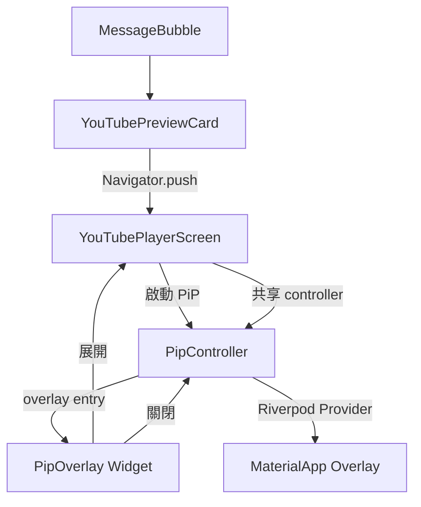
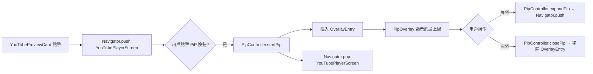

# 技術設計文件：YouTube Player Screen & PiP

## 概覽

本功能在現有 YouTube inline player 基礎上，改良播放體驗：點擊縮圖後導航至獨立的 `YouTubePlayerScreen`，並支援畫中畫（PiP）模式。PiP 以 app 內浮動視窗（in-app overlay）實作，覆蓋於所有頁面之上，支援拖曳、吸附角落、播放/暫停、展開、關閉。

### 設計原則

- **最小侵入性**：`YouTubePreviewCard` 僅改變點擊行為，縮圖顯示邏輯不變；`MessageBubble` 的狀態保護邏輯完全保留
- **單一播放器實例**：全域 `PipController`（Riverpod `StateNotifier`）確保同一時間最多一個 PiP Session
- **播放位置連續性**：`YoutubePlayerController` 在 PiP ↔ 全螢幕切換時共享，不重建，確保播放位置不中斷
- **沿用現有套件**：繼續使用 `youtube_player_flutter ^9.1.1`，不引入額外播放套件

---

## 架構

### 元件關係圖



### PiP Overlay 掛載方式

PiP Overlay 使用 Flutter 的 `Overlay` 機制，透過 `OverlayEntry` 插入至 `MaterialApp` 的根 `Overlay`，確保浮動視窗覆蓋所有路由頁面。`PipController` 持有 `OverlayEntry` 的參照，負責插入與移除。



### 檔案結構

```
app/lib/features/chat/
├── providers/
│   └── pip_controller.dart              # 新增：PiP 狀態管理（Riverpod StateNotifier）
└── ui/
    ├── youtube_player_screen.dart        # 新增：獨立播放 Screen
    └── widgets/
        ├── youtube_preview_card.dart     # 修改：點擊改為 Navigator.push
        ├── pip_overlay.dart              # 新增：浮動 PiP 視窗 Widget
        └── youtube_inline_player.dart   # 保留（供 YouTubePlayerScreen 內部使用）
```

---

## 元件與介面

### PipController（`pip_controller.dart`）

全域狀態管理，以 Riverpod `StateNotifier` 實作，管理 PiP Session 的完整生命週期。

```dart
/// PiP Session 狀態
class PipState {
  final bool isActive;
  final String? videoId;
  final Duration position;       // 當前播放位置
  final bool isPlaying;
  final Offset overlayPosition;  // PiP 視窗左上角座標

  const PipState({
    this.isActive = false,
    this.videoId,
    this.position = Duration.zero,
    this.isPlaying = true,
    this.overlayPosition = const Offset(16, 100),
  });
}

class PipController extends StateNotifier<PipState> with WidgetsBindingObserver {
  OverlayEntry? _overlayEntry;
  YoutubePlayerController? _playerController;
  BuildContext? _overlayContext;

  /// 啟動 PiP Session
  /// [controller] 為從 YouTubePlayerScreen 傳入的現有控制器（共享，不重建）
  void startPip({
    required String videoId,
    required YoutubePlayerController controller,
    required BuildContext context,
  });

  /// 展開 PiP → 返回 YouTubePlayerScreen
  void expandPip(BuildContext context);

  /// 關閉 PiP Session，釋放資源
  void closePip();

  /// 更新 PiP 視窗位置（拖曳中）
  void updatePosition(Offset position);

  /// 吸附至最近角落
  void snapToCorner(Size screenSize);

  /// 切換播放/暫停
  void togglePlayPause();
}

final pipControllerProvider =
    StateNotifierProvider<PipController, PipState>((ref) => PipController());
```

**生命週期管理**：
- `startPip`：若已有 PiP Session，先呼叫 `closePip()` 再啟動新的
- `AppLifecycleState.paused`：暫停播放
- `AppLifecycleState.resumed`：恢復播放（若 Session 仍在進行中）
- `closePip`：移除 `OverlayEntry`，呼叫 `_playerController.dispose()`，重置狀態

---

### YouTubePlayerScreen（`youtube_player_screen.dart`）

獨立播放 Screen，透過 `Navigator.push` 開啟。

```dart
class YouTubePlayerScreen extends ConsumerStatefulWidget {
  final String videoId;

  const YouTubePlayerScreen({super.key, required this.videoId});
}
```

**職責**：
- 建立 `YoutubePlayerController`（`autoPlay: true`）
- 顯示播放器（16:9）、標題區域、控制列
- 提供「畫中畫」按鈕，點擊後呼叫 `PipController.startPip`，並將 controller 所有權移交
- 若從 PiP 展開返回（`expandPip`），從 `PipController` 取回 controller，從當前位置繼續播放
- 返回時若無 PiP Session，釋放 controller

**進入方式判斷**：
```dart
// 透過 constructor 參數區分首次開啟 vs 從 PiP 展開
class YouTubePlayerScreen extends ConsumerStatefulWidget {
  final String videoId;
  final bool fromPip;  // true = 從 PiP 展開，controller 由 PipController 持有

  const YouTubePlayerScreen({
    super.key,
    required this.videoId,
    this.fromPip = false,
  });
}
```

---

### PipOverlay（`pip_overlay.dart`）

浮動 PiP 視窗 Widget，由 `PipController` 透過 `OverlayEntry` 插入。

```dart
class PipOverlay extends ConsumerStatefulWidget {
  const PipOverlay({super.key});
}
```

**規格**：
- 最小尺寸：寬 160dp × 高 90dp（16:9）
- 預設尺寸：寬 200dp × 高 112.5dp
- 圓角：`BorderRadius.circular(12)`
- 陰影：`BoxShadow` elevation 8
- 控制按鈕：播放/暫停（中央）、展開（右上角）、關閉（左上角）

**拖曳與吸附**：
```dart
GestureDetector(
  onPanUpdate: (details) {
    ref.read(pipControllerProvider.notifier)
       .updatePosition(currentPos + details.delta);
  },
  onPanEnd: (_) {
    ref.read(pipControllerProvider.notifier)
       .snapToCorner(MediaQuery.of(context).size);
  },
)
```

吸附邏輯：計算視窗中心點距四個角落的距離，吸附至最近角落，並以 `AnimatedPositioned` 做平滑動畫（duration: 200ms）。

---

### YouTubePreviewCard 修改點

僅修改點擊行為，縮圖顯示邏輯不變：

```dart
// 修改前
onTap: () => setState(() => _isPlayerExpanded = true),

// 修改後
onTap: () {
  // 若有進行中的 PiP Session，先關閉
  final pipController = ref.read(pipControllerProvider.notifier);
  if (ref.read(pipControllerProvider).isActive) {
    pipController.closePip();
  }
  Navigator.of(context).push(
    MaterialPageRoute(
      builder: (_) => YouTubePlayerScreen(videoId: widget.videoId),
    ),
  );
},
```

`YouTubePreviewCard` 需從 `StatefulWidget` 改為 `ConsumerStatefulWidget` 以存取 Riverpod。

---

## 資料模型

### PipState

| 欄位 | 類型 | 說明 |
|------|------|------|
| `isActive` | `bool` | PiP Session 是否進行中 |
| `videoId` | `String?` | 當前播放的 Video ID |
| `position` | `Duration` | 當前播放位置（精確度 1 秒） |
| `isPlaying` | `bool` | 是否正在播放 |
| `overlayPosition` | `Offset` | PiP 視窗左上角座標 |

### 播放器控制器生命週期

```
YouTubePlayerScreen 建立
    ↓ initState
YoutubePlayerController 建立（autoPlay: true）
    ↓ 用戶點擊 PiP
PipController.startPip（controller 所有權移交）
    ↓ YouTubePlayerScreen.dispose（不釋放 controller）
PipOverlay 使用同一 controller 繼續播放
    ↓ 用戶展開 PiP
YouTubePlayerScreen 重建（fromPip: true，從 PipController 取回 controller）
    ↓ 用戶關閉 PiP 或返回
PipController.closePip → controller.dispose()
```

### 吸附角落計算

```dart
Offset _calculateSnapPosition(Offset current, Size screen, Size pip) {
  final cx = current.dx + pip.width / 2;
  final cy = current.dy + pip.height / 2;
  final snapX = cx < screen.width / 2 ? margin : screen.width - pip.width - margin;
  final snapY = cy < screen.height / 2 ? margin : screen.height - pip.height - margin;
  return Offset(snapX, snapY);
}
```

---

## 正確性屬性

*屬性（Property）是在系統所有有效執行中都應成立的特性或行為，本質上是對系統應做什麼的形式化陳述。屬性作為人類可讀規格與機器可驗證正確性保證之間的橋樑。*

### Property 1：PiP 播放位置 Round-Trip

*對任意* 有效的 Video ID 與任意播放位置 `t`，從 `YouTubePlayerScreen` 切換至 PiP 再展開回 `YouTubePlayerScreen`，`PipController` 記錄的播放位置與展開後播放器的起始位置之差應不超過 2 秒。

**Validates: Requirements 6.1, 6.4, 3.3**

---

### Property 2：App 生命週期播放狀態 Round-Trip

*對任意* 進行中的 PiP Session，當 app 進入背景（`AppLifecycleState.paused`）再返回前景（`AppLifecycleState.resumed`），播放狀態應恢復至進入背景前的狀態（播放中 → 暫停 → 恢復播放；暫停中 → 暫停 → 維持暫停）。

**Validates: Requirements 4.2, 4.3**

---

### Property 3：PiP 關閉後資源釋放

*對任意* PiP Session，無論透過關閉按鈕、展開後返回或系統回收，`PipController.closePip()` 執行後 `isActive` 應為 `false`，且 `YoutubePlayerController` 的 `dispose()` 應被呼叫恰好一次，不發生重複釋放或洩漏。

**Validates: Requirements 3.4, 4.4, 1.4**

---

### Property 4：單一 PiP Session 不變式

*對任意* 操作序列（啟動 PiP、點擊縮圖、展開、關閉），`PipController` 中同時進行中的 PiP Session 數量應恆為 0 或 1，不存在多個並行 Session。

**Validates: Requirements 4.1, 2.2**

---

### Property 5：PiP 視窗位置邊界不變式

*對任意* 螢幕尺寸與拖曳手勢序列，PiP 視窗的位置（`overlayPosition`）應始終使視窗完全位於螢幕可見區域內（左邊界 ≥ 0、上邊界 ≥ 0、右邊界 ≤ 螢幕寬度、下邊界 ≤ 螢幕高度）。

**Validates: Requirements 3.1**

---

### Property 6：吸附角落冪等性

*對任意* PiP 視窗位置與螢幕尺寸，連續呼叫 `snapToCorner` 兩次應得到相同結果（第二次呼叫不改變位置），且結果必為四個角落之一。

**Validates: Requirements 3.5**

---

### Property 7：PiP 暫停狀態保持

*對任意* PiP Session，若在 PiP 模式下暫停影片後展開至 `YouTubePlayerScreen`，播放器應保持暫停狀態（`isPlaying == false`），不自動重新播放。

**Validates: Requirements 6.3**

---

### Property 8：縮圖點擊導航與播放器初始化

*對任意* 有效的 Video ID，點擊 `YouTubePreviewCard` 縮圖後，`Navigator` 應推入 `YouTubePlayerScreen`，且該 Screen 的 `YoutubePlayerController.initialVideoId` 應與傳入的 Video ID 完全相同。

**Validates: Requirements 1.1, 1.2**

---

### Property 9：MessageBubble 狀態保護不變式

*對任意* 訊息狀態（已收回、解密失敗、解密重試中、非文字訊息），`YouTubeDetector.extractVideoId` 的呼叫結果應被 guard clause 攔截，`YouTubePreviewCard` 不應被渲染，行為與修改前完全一致。

**Validates: Requirements 5.3**

---

## 錯誤處理

### 播放器初始化失敗

`YouTubePlayerScreen` 監聽 `YoutubePlayerController.value.hasError`，若發生錯誤則顯示錯誤提示並提供「返回」按鈕。若在 PiP 模式下發生錯誤，`PipOverlay` 顯示錯誤圖示並自動呼叫 `PipController.closePip()`。

### PiP Session 中 Screen 被系統回收

`PipController` 以 `WidgetsBindingObserver` 監聽 `AppLifecycleState`。若 `YouTubePlayerScreen` 在 PiP 進行中被回收，controller 所有權已移交 `PipController`，不受影響。若 app 被系統強制終止，`PipController.dispose()` 確保資源釋放。

### 網路中斷

`youtube_player_flutter` 內建網路錯誤處理，觸發 `hasError` 狀態，由上述錯誤處理流程統一處理。PiP 模式下顯示錯誤圖示，點擊可重試。

### 特殊訊息狀態保護（沿用現有邏輯）

`MessageBubble` 中的 YouTube 偵測 guard clause 完全不變：

| 狀態 | 條件 |
|------|------|
| 訊息已收回 | `msg.isUnsent == true` |
| 解密失敗 | `isDecryptionFailure == true` |
| 解密重試中 | `isDecryptingRetry == true` |
| 非文字訊息 | `msg.type != MessageType.text` |

---

## 測試策略

### 雙軌測試方法

- **單元測試**：驗證具體範例、邊界條件、UI 互動
- **屬性測試**：驗證對所有輸入都成立的普遍屬性

兩者互補，共同提供完整覆蓋。

### 屬性測試（Property-Based Testing）

使用現有的 `glados` 套件（`dev_dependencies`）進行屬性測試，每個屬性測試最少執行 **100 次迭代**。

**測試標籤格式**：`// Feature: youtube-player-screen-pip, Property {N}: {property_text}`

#### Property 1 測試：PiP 播放位置 Round-Trip

```dart
// Feature: youtube-player-screen-pip, Property 1: PiP 播放位置 round-trip
test('對任意播放位置，PiP 切換後位置誤差不超過 2 秒', () {
  Glados<Duration>(any.validPlaybackPosition).test((position) {
    final controller = PipController();
    controller.startPipWithPosition(position);
    final recorded = controller.state.position;
    expect((recorded - position).abs(), lessThanOrEqualTo(const Duration(seconds: 2)));
  });
});
```

#### Property 2 測試：App 生命週期播放狀態 Round-Trip

```dart
// Feature: youtube-player-screen-pip, Property 2: App 生命週期播放狀態 round-trip
test('對任意 PiP Session，paused 再 resumed 後播放狀態恢復', () {
  Glados<bool>(any.bool).test((wasPlaying) {
    final controller = PipController();
    controller.startPip(videoId: 'dQw4w9WgXcQ', isPlaying: wasPlaying);
    controller.didChangeAppLifecycleState(AppLifecycleState.paused);
    controller.didChangeAppLifecycleState(AppLifecycleState.resumed);
    expect(controller.state.isPlaying, equals(wasPlaying));
  });
});
```

#### Property 4 測試：單一 PiP Session 不變式

```dart
// Feature: youtube-player-screen-pip, Property 4: 單一 PiP Session 不變式
test('對任意操作序列，同時進行中的 PiP Session 數量恆為 0 或 1', () {
  Glados<List<PipAction>>(any.pipActionSequence).test((actions) {
    final controller = PipController();
    for (final action in actions) {
      action.apply(controller);
      expect(controller.activeSessionCount, lessThanOrEqualTo(1));
    }
  });
});
```

#### Property 5 測試：PiP 視窗位置邊界不變式

```dart
// Feature: youtube-player-screen-pip, Property 5: PiP 視窗位置邊界不變式
test('對任意螢幕尺寸與拖曳序列，PiP 視窗始終在螢幕內', () {
  Glados2<Size, List<Offset>>(any.screenSize, any.dragSequence).test((screen, drags) {
    var pos = const Offset(16, 100);
    for (final delta in drags) {
      pos = clampToScreen(pos + delta, screen, pipSize);
      expect(pos.dx, greaterThanOrEqualTo(0));
      expect(pos.dy, greaterThanOrEqualTo(0));
      expect(pos.dx + pipWidth, lessThanOrEqualTo(screen.width));
      expect(pos.dy + pipHeight, lessThanOrEqualTo(screen.height));
    }
  });
});
```

#### Property 6 測試：吸附角落冪等性

```dart
// Feature: youtube-player-screen-pip, Property 6: 吸附角落冪等性
test('對任意位置，連續呼叫 snapToCorner 兩次結果相同', () {
  Glados2<Offset, Size>(any.offset, any.screenSize).test((pos, screen) {
    final snap1 = calculateSnapPosition(pos, screen, pipSize);
    final snap2 = calculateSnapPosition(snap1, screen, pipSize);
    expect(snap1, equals(snap2));
  });
});
```

#### Property 8 測試：縮圖點擊導航與播放器初始化

```dart
// Feature: youtube-player-screen-pip, Property 8: 縮圖點擊導航與播放器初始化
test('對任意有效 videoId，點擊縮圖後 controller.initialVideoId 與傳入值相同', () {
  Glados<String>(any.validYoutubeVideoId).test((videoId) {
    final screen = YouTubePlayerScreen(videoId: videoId);
    // 驗證 controller 以正確 videoId 初始化
    expect(screen.videoId, equals(videoId));
  });
});
```

#### Property 9 測試：MessageBubble 狀態保護不變式

```dart
// Feature: youtube-player-screen-pip, Property 9: MessageBubble 狀態保護不變式
test('對任意特殊狀態訊息，YouTubePreviewCard 不應被渲染', () {
  Glados<Message>(any.specialStateMessage).test((msg) {
    // specialStateMessage 生成 isUnsent/decryptionFailure/decryptingRetry/非文字 訊息
    final videoId = (msg.isUnsent || isDecryptionFailure(msg) ||
        msg.status == MessageStatus.decryptingRetry ||
        msg.type != MessageType.text)
        ? null
        : YouTubeDetector.extractVideoId(msg.content);
    expect(videoId, isNull);
  });
});
```

### 單元測試（Unit Tests）

測試檔案位置：`app/test/features/chat/`

#### PipController 單元測試

```dart
group('PipController', () {
  test('startPip 設定 isActive = true', () { ... });
  test('closePip 設定 isActive = false 並釋放資源', () { ... });
  test('startPip 時若已有 Session，先關閉舊 Session', () { ... });
  test('app 進入背景時暫停播放', () { ... });
  test('app 返回前景時恢復播放', () { ... });
});
```

#### YouTubePlayerScreen Widget 測試

```dart
group('YouTubePlayerScreen', () {
  testWidgets('顯示 PiP 按鈕', ...);
  testWidgets('點擊 PiP 按鈕啟動 PiP Session', ...);
  testWidgets('fromPip=true 時從 PipController 取回 controller', ...);
  testWidgets('返回時若無 PiP Session 釋放 controller', ...);
});
```

#### PipOverlay Widget 測試

```dart
group('PipOverlay', () {
  testWidgets('顯示播放/暫停、展開、關閉按鈕', ...);
  testWidgets('點擊關閉按鈕呼叫 closePip', ...);
  testWidgets('點擊展開按鈕呼叫 expandPip', ...);
  testWidgets('拖曳後觸發 snapToCorner', ...);
});
```

#### YouTubePreviewCard 修改測試

```dart
group('YouTubePreviewCard（修改後）', () {
  testWidgets('點擊縮圖導航至 YouTubePlayerScreen', ...);
  testWidgets('點擊縮圖時若有 PiP Session 先關閉', ...);
  testWidgets('縮圖顯示邏輯與修改前一致', ...);
});
```

### 測試覆蓋目標

| 元件 | 測試類型 | 覆蓋目標 |
|------|----------|----------|
| `PipController` | 屬性測試 + 單元測試 | Session 管理、位置計算、生命週期 |
| `YouTubePlayerScreen` | Widget 測試 | 渲染、PiP 啟動、controller 移交 |
| `PipOverlay` | Widget 測試 + 屬性測試 | 拖曳、吸附、控制按鈕 |
| `YouTubePreviewCard` | Widget 測試 | 導航行為、PiP 衝突處理 |
